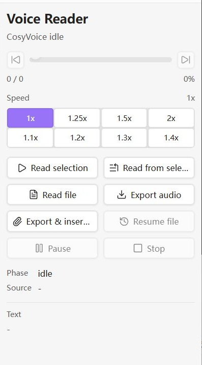
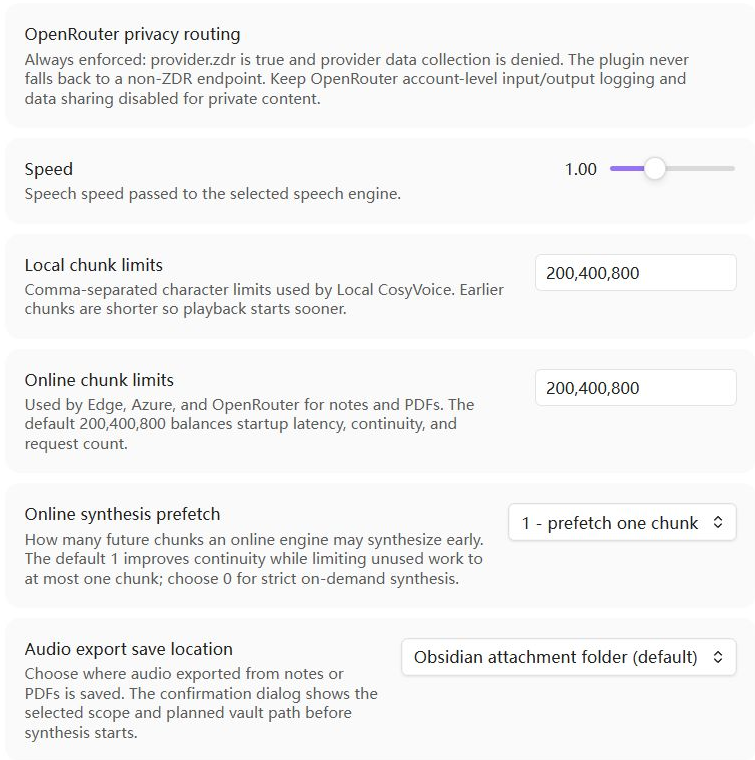

# Note and PDF Voice Reader

**Language:** English | [简体中文](README.zh-CN.md)

A privacy-first Obsidian desktop voice reader for Markdown notes and text-based PDFs. Use local CosyVoice by default, or explicitly opt in to Microsoft Edge online voice, Microsoft Azure Speech, or OpenRouter TTS.

## Highlights

- **Privacy first:** Local CosyVoice is the default. Each online engine requires separate, explicit consent before it can receive text.
- **Layout-aware PDF reading:** Local PDF extraction uses text coordinates to read common two-column papers left column first, while preserving full-width headings and section boundaries.
- **Progressive PDF start:** Markdown notes and text-based PDFs are parsed locally; ordinary text-based PDFs typically yield their first speech chunk within a few seconds, while later pages continue parsing.
- **Private, optional resume:** Reading-position history is off by default. When enabled, it stores only bounded resume metadata and a short text anchor, never the complete note or PDF body.
- **Bounded online prefetch:** Online modes prepare at most one upcoming chunk by default for smoother transitions. Set prefetch to `0` for strict on-demand synthesis.
- **Flexible PDF selection reading:** Continue reading from a selected position in a PDF, or read only the selected text.

Here, a text-based PDF means a PDF with selectable embedded text. Scanned or image-only PDFs need OCR first.

## Screenshots

Reader control panel:



Plugin settings. The script path shown here is a redacted example:



## Features

- Reads the current Markdown note or text-based PDF, selected text in either view, or from a Markdown/PDF selection start to the end of the active file.
- Extracts PDF text locally with Obsidian's built-in PDF.js, uses coordinates to improve common two-column reading order, and progressively feeds speech chunks while later pages continue parsing.
- Uses paragraph-, line-, sentence-, and clause-aware chunk boundaries while keeping configured character limits as hard upper bounds.
- Can optionally remember and resume the current Markdown or PDF position. The setting is disabled by default and includes a separate clear-history control.
- Opens a right-side `Voice Reader` control panel.
- Shows synthesis/playback phase, whole-reading progress, percentage, and text preview.
- Supports pause, resume, stop, Space to pause or resume in the control panel, repeated Left/Right Arrow 5-second seeking, previous/next chunk buttons, and progress dragging while the current audio chunk is playing.
- Provides right-panel speed presets: `1x`, `1.25x`, `1.5x`, `2x`, `1.1x`, `1.2x`, `1.3x`, and `1.4x`.
- Lets you choose `Local CosyVoice`, `Microsoft Edge online voice`, `Microsoft Azure Speech`, or `OpenRouter TTS` in settings. Local CosyVoice is the default.
- Lets you switch the complete plugin settings page between English and Chinese.
- Requires a separate opt-in before each online engine can receive text.
- Uses separate local and online chunk limits. Online notes and PDFs default to `200,400,800`, with at most one future chunk synthesized early by default.
- Uses Obsidian SecretStorage for Azure and OpenRouter API keys by default on Obsidian 1.11.4 or later, with an external key-file compatibility option.
- Provides common Chinese and English voice presets, model-specific OpenRouter voice menus, and custom voice ID fields.
- Cleans Markdown before synthesis and converts Markdown tables into speech-friendly column and row descriptions while skipping empty cells.
- Reads numeric citations such as `[28]`, `[28, 29]`, and `[28-30]` as spoken references while preserving unit labels such as `[s]` and `[%]`.
- Provides a settings-page `Restore defaults` button for resetting all plugin settings.
- Handles common LaTeX before synthesis with a configurable `Math reading language` setting:
  - Skips formulas longer than 12 non-space characters.
  - `English` is the default for public releases, for example `$a_b$` -> `a subscript b`.
  - `Chinese` keeps Chinese math words, for example `$a_b$` -> `a 下标 b`.
  - Converts short absolute-value notation such as `$|Y_{k,h}|$` into spoken words instead of sending raw vertical bars.
  - `Skip math` skips short formulas as well as long formulas.
  - Leaves common Greek commands as English names, such as `\alpha` -> `alpha`, `\beta` -> `beta`, and `\pi` -> `pi`.
  - Reads common non-Greek symbols such as `\leq`, `\times`, and `_`.
  - Unwraps style commands such as `\textbf{...}`, `\mathbf{...}`, and `\boldsymbol{...}`.
  - Reads short `\frac{a}{b}` as `a over b` in English mode or `a 分之 b` in Chinese mode.

## Privacy

By default, the plugin uses local TTS. In `Local CosyVoice` mode, the plugin itself does not send note or extracted PDF text to Microsoft, OpenAI, or another remote TTS service. The configured wrapper remains part of your trust boundary and may make its own network requests.

PDF extraction uses Obsidian's bundled PDF.js and `Vault.readBinary`; the PDF file itself is not uploaded by this feature. To support PDF selection commands, the plugin temporarily keeps the selection's page number and up to 2,000 characters of locator text in memory only; it is not saved to settings or diagnostic logs. When an online speech engine is selected and its consent is enabled, extracted PDF text chunks are transmitted under the same rules as note text. Scanned or image-only PDFs need OCR before the plugin can read them.

`Remember reading position` is off by default. If you enable it, `data.json` stores the file path, file timestamp, PDF page or speech-chunk index, update time, and a normalized text anchor capped at 180 characters. It does not store the complete note or PDF body. Use `Clear saved reading positions` to remove all saved anchors; disabling the setting stops future use and updates but does not silently delete existing history.

Edge, Azure, and OpenRouter are opt-in online modes. Edge passes each chunk to the configured `edge-tts` executable. Azure sends each chunk by HTTPS to the selected Azure Speech cloud and region. OpenRouter sends each chunk to OpenRouter and an eligible upstream TTS provider. The plugin will not start an online mode until its separate online-processing consent setting is enabled. OpenRouter consent permits that transmission only; it does not permit non-ZDR routing. By default, the plugin may synthesize the next chunk while the current chunk is playing, but it never prefetches more than one future chunk. Stopping early can therefore leave at most one prefetched chunk unused. Set prefetch to `0` for strict on-demand synthesis. Provider billing units vary, so this bounds avoidable work rather than guaranteeing a fixed cost reduction.

Temporary text and audio are stored in a vault-specific folder under the operating system temporary directory, not inside the Obsidian vault. With `Clean temporary audio` enabled, plaintext chunk files are removed immediately after synthesis, remaining session files are removed when reading ends or stops, and stale plugin-owned files plus the legacy in-vault cache are cleaned at startup. Diagnostic logging is off by default; when enabled, it records only bounded failure metadata without note names, note text, or child-process output.

Azure and OpenRouter keys use Obsidian SecretStorage by default on Obsidian 1.11.4 or later. The plugin's `data.json` contains only the selected secret identifier, not the secret value. Obsidian documents SecretStorage as vault-specific local secret storage; it should not be described as a guaranteed operating-system credential manager or macOS Keychain integration. A one-line key file outside every vault remains available as a compatibility fallback, and existing key-file configurations retain that mode when upgraded. See the official [Obsidian SecretStorage guide](https://docs.obsidian.md/plugins/guides/secret-storage).

Microsoft states that its real-time text-to-speech API does not retain the submitted text or generated audio; the text is still transmitted to and processed by the selected Azure Speech service. Confirm the terms applicable to your cloud and subscription. See [Azure Speech text-to-speech data privacy and security](https://learn.microsoft.com/en-us/azure/ai-foundry/responsible-ai/speech-service/text-to-speech/data-privacy-security).

Every OpenRouter request forces `provider.zdr: true` and `provider.data_collection: "deny"`; when no endpoint satisfies those restrictions, synthesis fails rather than weakening the policy. OpenRouter states that prompt storage is opt-in by default, but account-level input/output logging or data-sharing settings can still change that behavior, and request metadata is retained. Keep those account settings disabled for private content. See [OpenRouter data collection](https://openrouter.ai/docs/guides/privacy/data-collection) and [Zero Data Retention](https://openrouter.ai/docs/guides/features/zdr).

## Disclosures

- Network use: local mode launches your wrapper; Edge mode uses `edge-tts`; Azure uses an official regional endpoint derived from the selected cloud and validated region; OpenRouter uses the fixed `https://openrouter.ai/api/v1/audio/speech` endpoint.
- Shell execution: the plugin launches the configured PowerShell wrapper in local mode or the configured `edge-tts` executable in Edge mode. Azure and OpenRouter modes do not launch shell commands.
- Direct storage access: temporary files are written under the operating system temporary directory. The plugin checks the local wrapper path and reads Azure/OpenRouter credentials from Obsidian SecretStorage or a configured key file outside the vault.
- Telemetry: the plugin does not include client-side or server-side telemetry.
- Updates: the plugin does not include a self-update mechanism.

## Requirements

- Obsidian desktop.
- For `Local CosyVoice`: a working local CosyVoice setup and a PowerShell wrapper compatible with:

```powershell
cosyvoice-wrapper.ps1 -InputPath <txt> -OutputPath <wav> -Speed <speed>
```

A recommended script path is:

```text
%LOCALAPPDATA%\note-reader-cosyvoice\cosyvoice-wrapper.ps1
```

For local CosyVoice installation, hardware guidance, OS-specific notes, and wrapper examples, see [Local CosyVoice setup](docs/local-cosyvoice-setup.md).

For `Microsoft Edge online voice`: install the `edge-tts` CLI and either make the command available on PATH or enter its absolute executable path in `Edge TTS executable`. The plugin calls it with `--file`, `--write-media`, `--voice`, and `--rate`.

### Install And Configure Microsoft Edge Online Voice

[`edge-tts`](https://github.com/rany2/edge-tts) is a third-party Python package published on [PyPI](https://pypi.org/project/edge-tts/) that calls Microsoft Edge's online text-to-speech service. It is not bundled with this plugin and is not a local voice model.

Recommended command-line-only install:

```powershell
pipx install edge-tts
```

If `pipx` is not installed yet:

```powershell
py -m pip install --user pipx
py -m pipx ensurepath
```

Then open a new PowerShell window and run `pipx install edge-tts`.

Alternative install if you manage Python packages directly:

```powershell
py -m pip install --user edge-tts
```

After installation, open a new PowerShell window and verify that the command is available:

```powershell
edge-tts --help
```

To list available voices:

```powershell
edge-tts --list-voices
```

Then open `Settings -> Note and PDF Voice Reader`:

1. Set `Speech engine` to `Microsoft Edge online voice`.
2. Enable `Allow Edge online processing`.
3. Set `Edge TTS executable` to either `edge-tts` or an absolute path to the executable.
4. Choose a common voice preset or enter a custom voice ID.
5. Adjust `Speed` if needed. The plugin converts this to the `edge-tts --rate` option.

Common presets include `zh-CN-XiaoxiaoNeural`, `zh-CN-YunxiNeural`, `zh-CN-YunyangNeural`, `en-US-JennyNeural`, `en-US-GuyNeural`, and `en-GB-SoniaNeural`. Use `edge-tts --list-voices` for the complete list supported by your installed version.

If Obsidian cannot find `edge-tts`, use the absolute executable path in the plugin settings and fully restart Obsidian. Do not rely on an unrelated application's private virtual environment unless you intentionally trust and maintain that installation.

Privacy note: Edge mode sends each text chunk to Microsoft Edge TTS. Keep `Speech engine` set to `Local CosyVoice` for private or sensitive notes.

### Store Azure and OpenRouter API keys

On Obsidian 1.11.4 or later, the recommended and default `API key storage` choice is `Obsidian SecretStorage`. Use the secret control on the plugin settings page to create or select a secret containing the raw API key. Only that secret's identifier is saved in this plugin's `data.json`; the key value remains in Obsidian's vault-specific local secret store.

For an older Obsidian release or an existing file-based setup, select `External one-line key file`. Create a plain-text file outside every Obsidian vault, put the key on its only non-empty line, and do not sync, commit, or share the file. An existing configuration with a key-file path is migrated to this compatibility mode automatically.

### Configure Microsoft Azure Speech

Azure mode uses the official real-time Speech REST endpoint and supports Azure public cloud and Azure China operated by 21Vianet. Create a Speech resource in the intended cloud, then note its region and one subscription key. The required HTTPS request, SSML body, authentication header, and audio output header follow Microsoft's [text-to-speech REST API reference](https://learn.microsoft.com/en-us/azure/ai-services/speech-service/rest-text-to-speech).

If you select the external key-file fallback, a suitable path is:

```text
C:\Users\you\AppData\Local\note-reader-cosyvoice\azure-speech-key.txt
```

Then open `Settings -> Note and PDF Voice Reader`:

1. Set `Speech engine` to `Microsoft Azure Speech`.
2. Enable `Allow Azure online processing`.
3. Select `Azure public cloud` or `Azure China operated by 21Vianet`.
4. Enter the resource region, such as `eastasia`, `southeastasia`, `chinaeast2`, or `chinanorth3`.
5. Choose `Obsidian SecretStorage` and create/select the Azure key secret, or choose the external file option and enter its absolute path.
6. Choose a common voice preset or enter a custom Azure voice ID.

Presets include Mandarin Chinese `zh-CN-XiaoxiaoNeural`, `zh-CN-XiaoyiNeural`, `zh-CN-YunxiNeural`, and `zh-CN-YunyangNeural`; Cantonese and Taiwanese Mandarin; common US English `en-US-JennyNeural`, `en-US-GuyNeural`, and `en-US-AriaNeural`; and common UK English `en-GB-SoniaNeural` and `en-GB-RyanNeural`. The default Edge and Azure voice is the UK male voice `en-GB-RyanNeural`, selected for restrained long-form and academic reading.

The plugin derives the HTTPS host from the validated region and selected cloud; it does not accept a free-form Azure endpoint. Azure China endpoint differences are documented in [Azure Speech sovereign clouds](https://learn.microsoft.com/en-us/azure/ai-services/speech-service/sovereign-clouds). Check the current [Azure Speech language and voice list](https://learn.microsoft.com/en-us/azure/ai-services/speech-service/language-support) if a voice is unavailable in your region.

### Configure OpenRouter TTS

OpenRouter exposes an OpenAI-compatible TTS endpoint that accepts text and returns raw MP3 or PCM audio. This plugin always requests MP3 and validates the HTTP status and `Content-Type` before saving it. See the official [OpenRouter TTS documentation](https://openrouter.ai/docs/guides/overview/multimodal/tts).

The plugin retries temporary `408`, `425`, `429`, `500`, `502`, `503`, and `504` responses and transient network failures up to three total attempts with short bounded delays. It does not retry credential, model, voice, privacy-policy, malformed-request, or unexpected-content errors. A final `HTTP 502` therefore indicates that OpenRouter or its upstream provider remained unavailable after the limited retries, rather than normally indicating an unsupported text character.

Create a dedicated API key in [OpenRouter API Keys](https://openrouter.ai/settings/keys). Use a low spending limit and an expiration date where appropriate. If you select the external key-file fallback, a suitable path is:

```text
C:\Users\you\AppData\Local\note-reader-cosyvoice\openrouter-api-key.txt
```

Then open `Settings -> Note and PDF Voice Reader`:

1. Set `Speech engine` to `OpenRouter TTS`.
2. Enable `Allow OpenRouter online processing`.
3. Choose `Obsidian SecretStorage` and create/select the OpenRouter key secret, or choose the external file option and enter its absolute path.
4. Choose a built-in ZDR-compatible model and one of its voices, or enter custom IDs.
5. Keep OpenRouter account-level input/output logging and input/output data sharing disabled.

The default is `hexgrad/kokoro-82m` with the UK English male voice `bm_george`, selected for restrained long-form and academic reading. Voice IDs are model-specific and are not interchangeable. The built-in catalogs were checked against OpenRouter's live `speech` plus `zdr=true` model API on 2026-08-26:

- `microsoft/mai-voice-2-flash`: all four voices currently exposed by OpenRouter: US English `Harper`, Mexican Spanish `Valeria`, French `Soleil`, and German `Klaus`.
- `microsoft/mai-voice-2`: the same four currently exposed voices. OpenRouter states that MAI-Voice-2 ships four voices, so the plugin cannot safely provide six or add Chinese/UK IDs that the API does not accept.
- `google/gemini-3.1-flash-tts-preview`: 12 curated presets from the 30 voices currently exposed by OpenRouter, including informative, clear, even, knowledgeable, firm, mature, warm, gentle, and breezy delivery styles. Google describes these multilingual voices by style rather than fixed gender or US/UK accent.
- `hexgrad/kokoro-82m`: 12 presets, with two voices in each requested group: Mandarin Chinese female, Mandarin Chinese male, US English female, US English male, UK English female, and UK English male.

The settings page shows a short characteristics note and only the presets for the selected model. Model, voice, and ZDR endpoint availability can change, so use the live [`speech + ZDR` model API](https://openrouter.ai/api/v1/models?output_modalities=speech&zdr=true) as the source of truth. The delivery-style names come from [Google's Gemini TTS voice list](https://ai.google.dev/gemini-api/docs/speech-generation), and Kokoro language/gender groups follow its [upstream voice catalog](https://huggingface.co/hexgrad/Kokoro-82M/blob/main/VOICES.md). Custom model IDs remain available, but a model with no eligible ZDR endpoint returns an error because the plugin never relaxes its privacy routing rules.

## Model Storage, Other TTS Engines, And Chunk Limits

This plugin does not download models. Plan storage for the local TTS runtime before installing a voice model:

- Current CosyVoice model repositories are often several GB each. As of 2026-06, public Hugging Face examples range from about `2.5 GB` for a 300M model to about `9 GB` for a 0.5B CosyVoice3 model.
- Reserve more than the raw model size. A practical starting point is `10-20 GB` for one model and `30 GB+` if you keep multiple models, source checkouts, Conda environments, and caches.
- Put model files and caches on a local SSD when possible. Avoid syncing model folders through cloud-drive clients.

The configured script can call another local TTS engine instead of CosyVoice if it follows the same wrapper contract: read UTF-8 text from `-InputPath`, write a valid WAV file to `-OutputPath`, accept `-Speed`, and exit non-zero with a clear error on failure. Check the other model's license, language coverage, audio format, speed controls, startup latency, and whether it sends text outside your machine or trusted local network.

The Edge, Azure, and OpenRouter online modes are separate from the local wrapper contract. They write temporary MP3 files and use their corresponding voice setting. OpenRouter may ignore `Speed` for models whose provider does not support that parameter.

Use `Local chunk limits` to balance local startup latency and synthesis stability:

- CPU-only or low-end GPU: start with `30,60,90,120,160,200`.
- Mid-range GPU: use the default `40,80,120,160,280,320`.
- Faster GPU or low-latency local service: try `80,140,220,320,480,640`.
- If synthesis times out, fails, or the first audio takes too long, lower the numbers. If speech sounds too fragmented and your model is stable, raise them gradually.

`Online chunk limits` applies to both notes and PDFs in Edge, Azure, and OpenRouter modes. Its default is `200,400,800`, which uses a shorter first request and longer later requests to balance startup time, continuity, and request count.

`Online synthesis prefetch` defaults to `1`: while the current chunk is playing, the plugin may prepare the next chunk to improve continuity. It never prepares more than one future chunk, so stopping early can leave at most one prefetched request unused. Set it to `0` when avoiding every unused future request matters more than the pause between chunks.

## Commands

- `Open voice reader controls`
- `Read current note or PDF aloud`
- `Resume reading current note or PDF`
- `Read current PDF aloud`
- `Read current PDF from selection aloud`
- `Read selection aloud`
- `Read from selection aloud`
- `Pause or resume voice reading`
- `Seek backward 5 seconds`
- `Seek forward 5 seconds`
- `Move to previous reading chunk`
- `Move to next reading chunk`
- `Stop voice reading`

## Keyboard And Progress Seeking

When the `Voice Reader` control panel is focused, Space pauses or resumes reading, and Left Arrow or Right Arrow seek backward or forward in 5-second steps while audio is available.

The triangle buttons beside the progress bar jump to the previous text chunk or the next text chunk. Already synthesized chunks are reused when possible; otherwise the target chunk is synthesized before playback.

The progress bar shows whole-reading progress across all chunks. While audio is playing, the bar can be clicked or dragged. Seeking is limited to the currently loaded audio chunk; dragging outside that chunk is clamped to the nearest point in the current chunk.

## PDF Reading

Open a PDF stored in the vault, then click `Read file` in the control panel or run a PDF-capable command. Text extraction happens locally page by page. Once enough text for the first configured chunk is available, synthesis and playback can begin while later pages continue parsing. The Stop button cancels parsing, playback, and outstanding synthesis requests.

To start at a specific position, select a recognizable phrase in the PDF text layer and click `Read from selection`, or run `Read current PDF from selection aloud`. The plugin starts extraction on that page, matches the selected phrase in the extracted text, and reads through the end of the PDF. `Read selection` reads only the selected PDF text. If the visual text layer cannot be matched to the PDF's embedded text order, the plugin displays a notice and starts at the beginning of the selected page.

The PDF must contain selectable embedded text. Password-protected, damaged, scanned, or image-only files cannot be extracted; run OCR or unlock the file first. Version 0.4.0 uses text coordinates to recognize common two-column pages and read each vertical band left column before right column, while treating full-width headings as boundaries. Unusual layouts, rotated text, sidebars, and complex tables can still require a manual selection start or a better-tagged source PDF.

If `Remember reading position` is enabled, use `Resume file` in the control panel or `Resume reading current note or PDF` in the command palette. PDF resume starts on the saved page and locates the short anchor again; Markdown resume locates the same normalized anchor and falls back to the nearest saved chunk if the note changed.

## Development

Source modules live under `src/`. Build and run all tests before publishing:

```powershell
npm install
npm test
```

The build bundles `src/main.js` and its local modules into the single root `main.js` required by the Obsidian Community installer. `obsidian` remains an external runtime dependency supplied by the host application.

## Shared Package Contents

The install package contains only:

- `manifest.json`
- `main.js`
- `styles.css`
- `README.md`
- `INSTALL.md`
- `LICENSE`

It intentionally excludes `data.json`, legacy `cache`/`last-error.log` files, system temporary data, secrets, and local test files.

## License

MIT.
