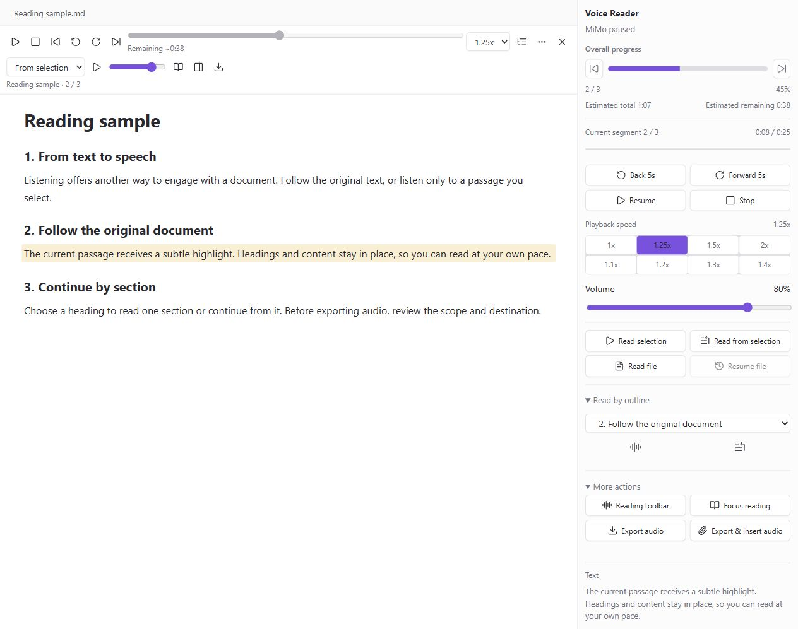
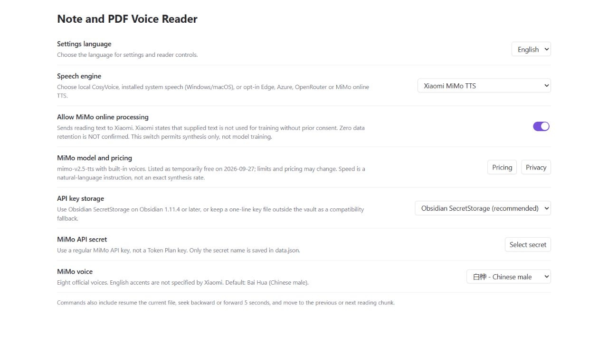
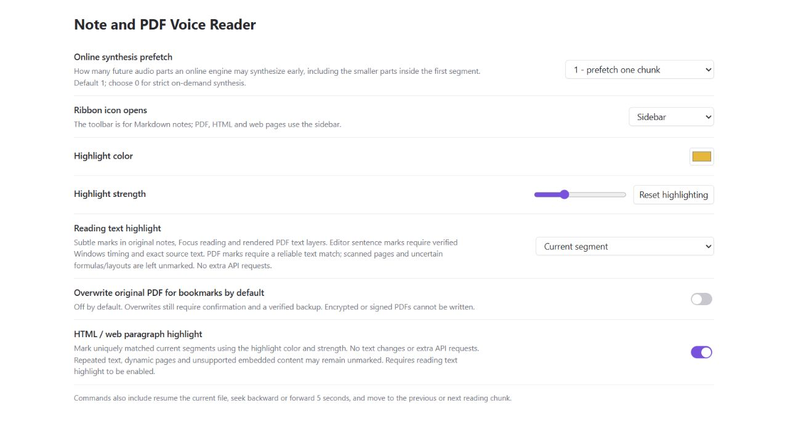
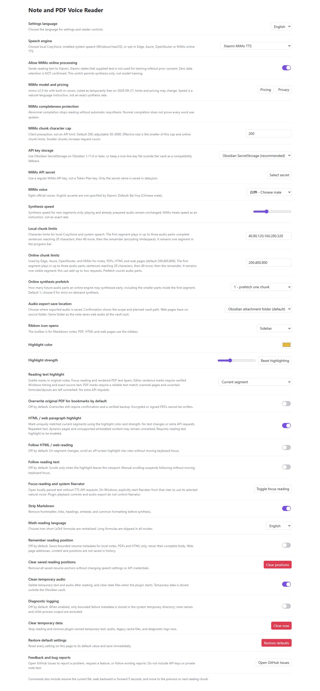

# Note and PDF Voice Reader

**Language:** English | [简体中文](README.zh-CN.md) | [Deutsch](README.de.md) | [Français](README.fr.md) | [Русский](README.ru.md) | [한국어](README.ko.md) | [日本語](README.ja.md) | [Español](README.es.md) | [Italiano](README.it.md) | [Português](README.pt.md)

Read aloud your **notes, PDFs, HTML files and web pages** in Obsidian. Listen while following the original document, jump between sections, or export audio for later.

**One-click reading toolbar:** click the audio icon in the pane header to show or hide playback controls above the original document.


English demo with public sample text, rendered from the plugin's interface code; appearance varies by theme.

## Why use it?

- **Privacy under your control.** Document text is extracted locally. Online speech requires explicit consent; installed offline system voices and local CosyVoice keep synthesis on your device.
- **Read from where you are.** Read the whole document, only selected text, or continue from a selected position, including in PDFs.
- **Follow along without losing the layout.** Optional, adjustable highlighting in Markdown/live preview, text PDFs, local HTML and Web viewer, with reading-order support for common two-column PDF papers. The toolbar stays with the original content.
- **Listen to Copilot replies.** Read saved conversations: the latest reply, last two replies, or a question and answer. Preview your selection, or right-click the toolbar chat icon to read the most recently saved conversation's latest answer.
- **Navigate by outline.** Use note headings, PDF bookmarks or locally inferred PDF headings, and HTML headings or coherent section numbering. Read one section or continue from it.
- **Academic reading without the noise.** Skip complex LaTeX formulas and long numeric tables, use concise `sub` / `bar` notation, and merge adjacent numbered references. Keep short formulas, small tables and prose; PDF filtering is conservative.
- **Start listening sooner.** Progressive text extraction and short startup audio parts reduce the wait; later PDF pages can be processed while playback begins.
- **Avoid unnecessary synthesis.** By default, online playback prepares only one upcoming audio part. Choose zero prefetch for on-demand synthesis. Audio export always asks for confirmation.
- **Keep an audio copy.** Export all, selected or remaining text; insert the result into a Markdown note. If final merging fails, retry with retained audio instead of synthesizing it again.

Text PDFs must contain selectable text; scanned pages need OCR first. Highlighting and inferred outlines depend on source structure and are not guaranteed for every layout. Sentence-level highlighting requires reliable timing; other engines use segment highlighting.

## Choose a voice service

For a first try, choose based on what matters most to you, rather than installing every engine.

| Your priority | Start with | What you need | Important trade-off |
| --- | --- | --- | --- |
| Try Chinese or English speech without an initial API charge | **Xiaomi MiMo** | A regular MiMo API key | Currently temporarily free; online processing, not confirmed ZDR |
| Many online voices without a user API key | **Edge TTS** | Install the third-party `edge-tts` helper | Online, no explicit ZDR guarantee for plugin calls |
| The simplest offline setup | **System local speech** | A compatible installed Windows/macOS voice | No speech API quota; quality depends on installed voices |
| Compare speech models without a local helper | **OpenRouter TTS** | API key and usable account credit | Paid, model-dependent voices; enforced ZDR routing |
| Keep text local with a dedicated voice model | **Local CosyVoice** | Local runtime, model and wrapper | More setup and local computing resources |
| Use an existing Microsoft cloud resource | **Azure Speech** | Speech resource, region and key | Cloud setup and service quota |

MiMo's [official pricing](https://mimo.mi.com/docs/zh-CN/price/pay-as-you-go) lists `mimo-v2.5-tts` as temporarily free, checked **2026-10-04**. Availability, prices and quotas can change. Voice quality is subjective: test a short, non-sensitive passage before choosing.

## Quick start

### Install

On **Obsidian desktop**, install and enable [Note and PDF Voice Reader](https://community.obsidian.md/plugins/note-reader-cosyvoice), then open its settings. Manual installation is covered in [INSTALL.md](INSTALL.md).

The initial engine is local CosyVoice, which needs configuration. **Choose one of the following engines before your first reading.** Online consent applies only to the service you enable.

### 1. Xiaomi MiMo: a convenient first try for Chinese

1. Create a **regular API key** in the [MiMo console](https://platform.xiaomimimo.com/), not a Token Plan key.
2. Select **Xiaomi MiMo TTS** and store the key using **Obsidian SecretStorage**.
3. Read the notice and enable **Allow MiMo online processing**.
4. Keep the default **Bai Hua / 白桦 (male, supports Chinese and English)** or select another voice, then try a short selection.

MiMo sends text to Xiaomi. Its [privacy policy](https://privacy.mi.com/XiaomiMiMoPlatform/zh_CN/) says supplied text is not used for training without prior consent; this is **not a zero-retention guarantee**.

### 2. Edge TTS: online voices without an API key

1. Install [`edge-tts`](https://github.com/rany2/edge-tts) using `pipx install edge-tts`. If Python/pipx is not installed, follow the [detailed installation guide](#install-and-configure-microsoft-edge-online-voice).
2. Select **Microsoft Edge online voice**, enable **Allow Edge online processing**, and set **Edge TTS executable** to `edge-tts` or its full executable path.
3. Choose a voice and test a short selection.

The helper is third-party software, not bundled with the plugin. Speech is online, even though the helper runs locally. **The interface does not explicitly guarantee ZDR for these requests.**

### 3. System speech: no API key, no cloud speech quota

1. Select **System local speech (Windows/macOS)**.
2. Choose **System default** or a detected installed voice; use **Refresh** after installing more voices.
3. Preview the voice, then read a selection.

With compatible offline voices, no speech text is sent to a TTS provider. **Windows Narrator Natural / Natural HD downloads are not available through this plugin's system synthesis interface.** Ordinary installed voices are supported; quality varies. See the voice-download and Narrator notes below.

### 4. OpenRouter: model choice with enforced ZDR

**Price references:** settings show dated, model-specific prices for the verified ElevenLabs and MAI presets, with per-character units, a per-10,000-character estimate and an official-pricing link. These are offline snapshots, not live quotes. The recorded ElevenLabs offer ends on October 19, 2026 at 15:00 UTC; settings opened afterward show only the last checked list price and a reminder to verify it. Models without a verified snapshot show no numeric estimate. Repeat synthesis, fees and taxes can increase the final cost.

**ElevenLabs via OpenRouter:** choose Multilingual v2, Flash v2.5, Eleven v4 or v4 Turbo, with George, Sarah, Daniel, Alice, Brian or Lily. Existing defaults are unchanged. Audio uses MP3 at normal synthesis speed; adjust playback speed in the player. ZDR and denial of data collection remain mandatory; an unavailable route fails without relaxing privacy. The [speech catalog](https://openrouter.ai/api/v1/models?output_modalities=speech) and [ZDR endpoint list](https://openrouter.ai/api/v1/endpoints/zdr) were checked on 2026-10-08. Prices and availability can change.

**Optional continuity:** these four models show an ElevenLabs advanced section with an experimental, default-off continuity toggle. It sends only neighboring sentences within the current reading range, up to 160 characters per side, through `provider.options.elevenlabs`; it never reads outside a selected range or uses request history. Other models hide the option and receive no context parameters, while the saved preference is retained. No cloud pronunciation dictionary or automatic performance tags are added. Source audio tags may affect delivery. Parameter support follows the [OpenRouter announcement](https://openrouter.ai/blog/announcements/elevenlabs-on-openrouter/); paid listening tests have not been performed, so improved sound is not guaranteed.

**Local term pronunciations:** in Academic settings, enable rules such as `AI = artificial intelligence`, one per line. Rules are case-sensitive literal matches (not regex), longest match first, without recursive replacement. Up to 100 rules are stored locally; each term is limited to 80 characters and each pronunciation to 120. Online engines receive the substituted speech text, not the rule list. Source documents and original reading positions are preserved; expanded requests are split to respect engine limits. These rules also apply to export. Rules take effect next session; edited rules do not change already-prepared audio.

1. Create an [OpenRouter API key](https://openrouter.ai/settings/keys), set a spending limit, and ensure the account has usable credit.
2. Select **OpenRouter TTS**, store the key in **Obsidian SecretStorage**, and enable **Allow OpenRouter online processing**.
3. Choose a model and one of its compatible voices. Test a short selection before a long reading or export.
4. Keep account-level logging and data sharing disabled for private content.

The plugin always requests ZDR and denies provider data collection; it does not relax these settings if a route is unavailable. Text still passes through OpenRouter and an eligible provider. Voices and prices differ by model.

### 5. Bring your own speech API (BYOK)

Select **Custom speech API (BYOK)**, add a profile, then choose **OpenAI-compatible**, **ElevenLabs** or **MiniMax**. Profiles keep their own model, voice ID and credential reference. OpenAI-compatible services must implement the speech endpoint, not just a chat API; enter the complete HTTPS speech URL. ElevenLabs uses its official endpoint; MiniMax offers international and mainland China endpoints, which require the matching account/key.

1. Enter the model and an available voice ID. The documentation button opens the provider's official API reference.
2. Choose an Obsidian SecretStorage secret, or a one-line key file outside the vault. Never paste a key into the address or model fields.
3. Review the endpoint and enable **Allow this configuration to process text**. The confirmation covers transmission, possible charges, training and retention risks. It is **not a ZDR or no-training certification** and does not enforce OpenRouter's ZDR routing policy.
4. Use **Preview** for a fixed short sample before reading sensitive material. It consumes provider quota and replaces current playback.

Changing the API type/address clears credential references; changing the model, voice or credential selection requires renewed consent. Revoking permission stops an active BYOK task. Profiles use MP3 for playback and export, local playback-speed control, and the existing online chunk/prefetch settings, with an additional configurable 800-character default cap. Failed BYOK requests are **not automatically retried**. Google Cloud, AWS Polly, arbitrary request scripts, voice cloning and non-speech OpenAI-compatible APIs are not included.

Protocol references: [OpenAI speech](https://developers.openai.com/api/docs/guides/text-to-speech), [ElevenLabs speech](https://elevenlabs.io/docs/api-reference/text-to-speech/convert), [MiniMax speech](https://platform.minimax.io/docs/api-reference/speech-t2a-http).

The authorization switch sits directly below profile selection, with the current permission status and destination. Expand **BYOK processing and billing risks** for this mode's notice, or use **View general privacy information** to open **Privacy and help**. The common disclosure there applies to every speech engine, not just BYOK. Default profile names follow the API type; manually named profiles keep their name and display the type alongside it.

### Start reading

Open a note, text PDF, local HTML file or a loaded Web viewer page. Open the reader sidebar or toolbar, choose **whole document**, **selection**, or **from selection**, then start playback.

**For local HTML:** first install and enable [HTML Reader](https://community.obsidian.md/plugins/obsidian-html-plugin) from **Settings -> Community plugins -> Browse**, then open a vault-local `.html` or `.htm` file in it. HTML Reader is required for HTML selections, reading from a selected position, and the original-page toolbar, highlighting and outline navigation. Whole-file text extraction itself does not depend on that renderer. External web pages use Obsidian's built-in **Web viewer**, not HTML Reader.

Use pause/resume, playback speed, volume, segment navigation and seeking without starting a new synthesis just to change playback speed. For exports, review the scope, character count and destination before confirming.

**Toolbar shortcuts (0.8.1):** **Space** pauses/resumes, and **Left/Right Arrow** seeks backward/forward five seconds, including across audio parts. In live preview and editing mode, these shortcuts work only while the toolbar or its buttons have focus; click a playback control or the toolbar background to focus it. In Markdown reading mode, they also work in the original reading pane while the toolbar is open. Text fields, sliders, menus and modified key combinations keep their normal keyboard behavior. Hover the pause/resume and seek buttons for shortcut hints.

## Interface

Public demonstration rendered from the current plugin's interface code, with sample text and an empty API-secret selection. Obsidian theme details can vary.

<details>
<summary>View the full reader and sidebar screenshot</summary>



</details>

**Voice setup:** engine selection, online consent and the default MiMo voice.



**Reading preferences:** highlighting, online prefetch and PDF bookmark saving.



<details>
<summary>View the complete settings page</summary>



</details>

## For stricter privacy or advanced setups

**Prefer no cloud text processing?** Use installed offline system voices for the easiest setup, or configure [local CosyVoice](docs/local-cosyvoice-setup.md) for a dedicated local model. For CosyVoice, install and test the runtime and model, select **Local CosyVoice**, and set **CosyVoice script** to your compatible wrapper. Keep online consent switches off. The configured runtime and wrapper remain part of your trust boundary.

**Already using Azure?** Select **Microsoft Azure Speech**, configure your Speech resource's cloud and region, save its key in SecretStorage, and enable Azure online processing. See [Azure configuration](#configure-microsoft-azure-speech).

Online speech, temporary audio, exported attachments and vault synchronization have different privacy boundaries. No service choice makes every part of the workflow automatically private. The reference below explains these boundaries and advanced controls.

## Detailed reference

<details>
<summary>Open feature details, privacy notes, engine configuration and development instructions</summary>

### System voice details

1. Select **System local speech (Windows/macOS)** in plugin settings. No API key, model download or extra TTS package is required when a compatible voice is already installed.
2. Choose **System default (already installed)** or an installed voice from the detected list. Use **Refresh** after installing voices and **Preview** to test a voice without sending note text to a provider. Windows and macOS voice preferences are stored separately.
3. Read and export using the usual controls. System speech produces normal-pace PCM WAV; the panel adjusts playback speed and volume without resynthesis. Exported WAV remains at normal pace. Pause, segment navigation, progress seeking and confirmed scoped export remain available.

**Optional Windows voice downloads:** Install ordinary system voices from **Settings -> Time & language -> Speech -> Manage voices -> Add voices**, then refresh the plugin list. Narrator-only downloads are separate: recent Windows 11 uses **Settings -> Accessibility -> Narrator** (or `Win+Ctrl+N`) -> **Narrator's voice -> Add voices -> Add**; older layouts may show **Add natural voices** or **Add legacy voices**. See [Microsoft's help](https://support.microsoft.com/en-us/accessibility/windows/narrator/appendix-a-supported-languages-and-voices). **The plugin cannot directly synthesize audio with Narrator Natural / Natural HD voices, even after download.** Microsoft does not currently provide a supported public interface for this plugin to use those Narrator voices; Windows system speech uses SAPI, not Narrator. Refreshing or downloading again cannot unlock them. Alternatively, use the independent **Reading text** view with Windows Narrator, as explained below. Do not modify the registry to force access. This limitation does not apply to macOS voices or Microsoft online speech services.

On macOS, open **System Settings -> Accessibility -> Read & Speak** (older versions: **Spoken Content**) and manage/download **System voice** options; names vary by version. Download a language or offered enhanced voice, then refresh the plugin list. See [Apple's official steps](https://support.apple.com/guide/mac-help/change-the-voice-your-mac-uses-to-speak-text-mchlp2290/mac). Siri-only voices may not appear in `say`.

**Privacy:** With installed offline voices, synthesis is local, similar to local CosyVoice: this mode does not send reading text to a TTS provider, install voice packs, or fall back to a cloud engine. Voice downloads require internet and are an explicit OS action. This is a simpler text-processing boundary than online TTS, not a guarantee about all OS telemetry, third-party installed voice engines, exported audio or vault synchronization. Temporary text/audio still follow the plugin's cleanup policy. No speech API quota is used. Voice quality and language coverage depend on installed voices; do not assume cloud-level neural quality. Windows native synthesis has been tested; macOS command handling has automated tests but still needs validation on a real Mac.

### Reading Toolbar and Focus Reading (0.8.0)

Settings let the ribbon icon open the sidebar, toolbar or both in Markdown, PDF, HTML Reader and Web viewer panes. Choose a highlight color and 5–60% strength, or reset highlighting independently. The sidebar includes a collapsible outline; export and diagnostic details are under More actions.

Markdown highlights follow the currently playing audio part while the logical segment number stays unchanged. Exact source text can receive a narrower mark in the editor; Reading view marks the corresponding paragraph or verified list item. Both use a single pale background, with an optional side marker under Playback and interface. Formula transformations and uncertain list layouts fall back conservatively. Editing the note clears stale highlights and shows one notice per reading session; restart reading to use the edited text. No additional speech requests are made.

Use **Reading toolbar** in the control panel, the pane header's audio icon, or **Toggle reading toolbar in current note, PDF, HTML or web page**. The toolbar stays above the original content, preserving images, embeds and layout. It provides pause/resume, segment navigation, five-second seeking, progress, speed, volume and three reading scopes. Close it without stopping playback. Outline controls are available for Markdown, PDF and local HTML Reader, not external Web viewer pages.

The outline menu uses the note's headings: select a heading to navigate, then explicitly choose to read that section (including nested subsections) or continue to the end. The additional controls support whole-note, selected-text and from-selection reading. Export still requires confirmation. A changed note invalidates cached reading positions rather than starting at an outdated location.

The optional **Focus reading** view remains useful for extracted text and system Narrator. Its selection commands use the actual selected occurrence, including repeated phrases. Reading from a selected position in a progressively loaded PDF body requires the complete body first.

**PDF highlighting:** a faint, connected line background follows the current audio part while the logical segment number stays unchanged. Reliable sentence timing can narrow the range further; this is not word-by-word synchronization. The full segment is uniquely anchored in locally parsed PDF text before mapping its active range to visible text layers. For cross-page segments, verified marks can appear on an already loaded page while the next page is still loading, and Locate follows the active part's page. Layout caching reduces repeated geometry work; text cleaning uses the reading session's settings. Uncertain layouts, transformed formulas and unavailable text layers receive no guessed marks. Scanned pages require OCR. Highlighting does not upload the PDF, make extra speech requests or automatically scroll the PDF.

**Locate current reading:** use the locate icon beside the toolbar speed control or in the sidebar progress heading to return to the current source passage without restarting playback. Markdown, PDF, HTML Reader and already-open Web viewer pages are supported. When only a PDF page or full segment can be located, a notice explains the fallback; changed or uncertain sources are not guessed.

**HTML/web highlighting:** an independent setting marks matched current paragraphs in HTML Reader and Web viewer (including Reader mode) with a single pale background, without rewriting the page or replacing selection. Formula-aware matching uses verified original prose; it does not imply exact word or sentence timing. Repeated text, changed content, unsupported browser versions and inaccessible frames remain unmarked. Optional following is off by default; when enabled, an off-screen new segment scrolls into view. This adds no speech API requests.

**PDF outline and bookmarks:** prefer existing bookmarks; otherwise detect numbered headings and typography locally. Review titles, numbering and levels, navigate, read one section or continue from it. The draggable title bar and Center button reposition the dialog; Select all / Deselect all control bookmark inclusion. Reopening an unchanged PDF reuses its outline and edits from a bounded memory-only cache (up to three PDFs, subject to a size cap). Reloading the plugin, clearing temporary data, file changes or cache eviction require reanalysis. No outline text is stored in settings.

**HTML outlines:** use semantic HTML headings first, with conservative detection of short, standalone consecutive section numbers such as `1`, `1.1` and `1.1.1`. Inferred entries are labeled; isolated numbers, missing parents, ordinary lists and dates are excluded where detectable. Navigate or explicitly read a section with its subsections, or continue from it. Review inferred headings: numbering alone cannot prove that a paragraph is a heading.

Saving bookmarks requires confirmation. Save a copy by default, or enable overwrite with a verified original backup. Existing bookmarks can be kept, merged or replaced. Encrypted or signed PDFs are refused. This writes PDF bookmarks, not a visible table-of-contents page, and does not change the document layout.

### PDF Footnotes

PDF reading skips recurring headers, footers, page numbers and confidently identified glossary tables by default. Settings can retain headers/footers or include the glossary in body reading. The PDF toolbar scope menu offers **Glossary only (whole PDF)** and **Footnotes only (whole PDF)** without changing global settings, and reports when no matching content is identified. Detection is local and does not modify the PDF. Selection-only reading is not filtered.

**PDF footnotes:** **PDF footnote reading** defaults to **Body only**. Choose **Footnotes after body**, **Original order, including footnotes**, or **Footnotes only** in settings. Detection conservatively combines bottom-page numbering, font size, spacing and extractable separator lines; uncertain text is retained. Full PDF reading and exports use this setting; selection-only reading and exports preserve the selected text. Detection varies with layout; original order provides a comparison mode.

### Read Saved Copilot Conversations

**Setup:** Install and enable the **Copilot** community plugin in Obsidian to create and save conversations. Copilot is a separate plugin and is not bundled with this reader. It is optional: ordinary note, PDF, HTML and web-page reading does not require it. This feature reads saved Markdown transcripts, so Copilot does not need to remain open while an existing saved conversation is read.

Enable **Autosave Chat as Markdown** in Copilot, then use the toolbar's **Read Copilot chat** icon, the sidebar's **More actions**, or the **Read saved Copilot chat** command. Choose a conversation, preview its text, and select the latest reply, last two replies, or latest question and answer. Reading only AI replies is the default; including your questions is optional.

For one-click playback, choose **Read latest reply** in the chat picker or **right-click the toolbar chat icon**. This reads only the latest saved AI answer in the most recently modified saved conversation, not necessarily the chat currently on screen. It never falls back to another conversation when no readable answer exists. Your current speech engine and online-processing consent still apply. Left-click continues to open the picker and preview.

The plugin finds vault folders named `copilot-conversations`; a custom vault-relative folder can be set in the reader settings. An explicitly open conversation note can be preselected. Otherwise you choose the conversation, so a recently modified file is never silently treated as the current chat. The picker reads only the selected file, up to 2 MB, and requires a refreshed preview if it changes.

This integration uses Copilot's saved `user` / `ai` Markdown messages and timestamp footers, checked against Copilot 4.0.13. It excludes saved context metadata, system/tool messages and recognized reasoning/tool envelopes. Unsaved replies are unavailable, and a pending question is not paired with an earlier answer. Pause, speed, volume and navigation use the normal player. Conversation playback does not add a reading-history anchor or inject buttons/highlights into Copilot's chat window.

Browsing and previewing are local and make no speech API calls. Playback uses the selected engine and its existing online-processing consent: online engines receive the selected text. The dialog identifies that destination before playback. The feature can be disabled in settings.

### Focus Reading, Highlighting and Windows Narrator

Click **Focus reading** in the control panel, or run **Toggle focus reading / Narrator document**. Click again, or use the view's back button, to close it and return to the original attached note without stopping playback. The view loads text locally without TTS requests or API secrets. Markdown uses Obsidian's native renderer and theme fonts, retaining headings, lists, emphasis, formulas and tables, with selectable text. Images and embeds are not automatically loaded; executable code-block processors and raw HTML are disabled in this view. Other formats display extracted text, not their original page layout. Playback reuses the existing queue, including progressively parsed PDF chunks; the view never saves a second document to settings.

- **Highlight:** off, current segment, or sentence when reliable timestamps exist. Original Markdown editor/live-preview and reading panes also receive temporary source-block marks without changing text or selection. Windows ordinary system voices collect word boundaries during the same synthesis; exact source matches allow sentence marks in the editor. Native Markdown reading mode uses block marking; other engine adapters use segments. Edits or uncertain source mapping disable original-note marks rather than guessing. PDF marks follow the conservative matching rules above. No extra per-sentence API requests are made.
- **Follow:** off by default. Only scrolls when a new highlight leaves the viewport; manual scrolling suspends following and keyboard focus stays unchanged. Text and selected ranges are not rebuilt on progress updates.
- **Narrator:** stop plugin playback, then choose the accessibility icon in the reading view and confirm startup. Select a starting paragraph and use Narrator key (`Caps Lock` or `Insert`) + `R`; `Ctrl` stops speech and Narrator key + `Esc` exits. Windows Narrator uses the voice selected in its own settings, including installed natural voices. This is an accessibility route, not direct synthesis through the plugin: the plugin's pause, seek, audio export and sentence timeline do not control Narrator. The plugin does not change the registry, install voice packs or terminate an already-running Narrator.

Windows WAV uses 16 kHz mono 16-bit PCM to avoid the observed boundary-time mismatch caused by resampling ordinary SAPI voices; macOS remains at 24 kHz. Invalid or incomplete boundary metadata falls back to segment highlighting. Windows English and Chinese public-text samples passed live boundary checks; macOS sentence synchronization is not implemented.

### Xiaomi MiMo TTS Quickstart

MiMo defaults to a configurable 200-character chunk cap (a conservative client setting, not an official API limit). Shorter configured limits are preserved. This can increase request count. Non-normal completion reasons and malformed/truncated WAV files stop reading without advancing or automatically resynthesizing. A normal completion signal is not proof of word-for-word fidelity; MiMo currently returns no audio transcript for verification.

1. Create a regular API key in the [MiMo console](https://platform.xiaomimimo.com/), not a Token Plan key.
2. Select **Xiaomi MiMo TTS** in the plugin settings. Store the key with Obsidian SecretStorage, or use a one-line key file outside the vault on older Obsidian versions.
3. Read the privacy notice and enable **Allow MiMo online processing**. Select one of eight official voices; the default is **Bai Hua / 白桦 (male, supports Chinese and English)**. Xiaomi does not specify US/UK accents for these presets.
4. Read or export a note/PDF using the existing controls. The model is `mimo-v2.5-tts`, producing WAV audio. Online chunking and the one-upcoming-chunk prefetch limit also apply. Synthesis speed is requested through a natural-language instruction, not a guaranteed numerical rate.

[Pricing](https://mimo.mi.com/docs/zh-CN/price/pay-as-you-go) lists this model as **temporarily free** as of 2026-10-04; pricing and quotas may change. The [MiMo privacy policy](https://privacy.mi.com/XiaomiMiMoPlatform/zh_CN/) states that supplied text is not used for training without prior consent, but **zero data retention is not confirmed**. Plugin consent only permits synthesis, not training. MiMo is a separate direct API engine, not an OpenRouter ZDR route. Voice cloning and voice design are not included.

## Features

- Reads the current Markdown note, text-based PDF or local HTML file, selected text in the corresponding view, or from the selection to the end of the active file. HTML selections integrate with HTML Reader.
- Extracts PDF text locally with Obsidian's built-in PDF.js, uses coordinates to improve common two-column reading order, and progressively feeds speech chunks while later pages continue parsing.
- Uses paragraph-, line-, sentence-, and clause-aware chunk boundaries while keeping configured character limits as hard upper bounds.
- Remembers local Markdown, PDF and HTML positions for the current session by default. Persistent history is opt-in, with a separate clear-history control.
- Exports all, selected, or remaining content from Markdown notes, text-based PDFs and local HTML files as one audio file: WAV for local CosyVoice and MiMo, MP3 for Edge, Azure and OpenRouter. Save it in Obsidian's attachment folder, beside the source file, or in a custom vault folder; Markdown notes also support exporting and inserting the completed attachment.
- Opens a right-side `Voice Reader` control panel.
- Shows synthesis/playback phase, whole-reading progress, percentage, and text preview.
- Supports pause, resume, stop, Space to pause or resume in the control panel, repeated Left/Right Arrow 5-second seeking, previous/next chunk buttons, and progress dragging while the current audio chunk is playing.
- Provides right-panel speed presets: `1x`, `1.25x`, `1.5x`, `2x`, `1.1x`, `1.2x`, `1.3x`, and `1.4x`.
- Lets you choose `Local CosyVoice`, `Microsoft Edge online voice`, `Microsoft Azure Speech`, or `OpenRouter TTS` in settings. Local CosyVoice is the default.
- Provides English and Chinese settings, plus German, French, Russian, Korean, Japanese, Spanish, Italian and Portuguese translations for core settings and playback controls. Some advanced help and secondary dialogs remain in English.
- Requires a separate opt-in before each online engine can receive text.
- Uses separate local and online chunk limits. Online notes, PDFs and HTML default to `200,400,800`, with at most one future audio part synthesized early by default. MiMo's additional chunk cap still applies.
- **Smart quick start** applies to any unprepared playback target, including later segments and chapter jumps: complete sentences reaching 20 non-whitespace characters, then 40 more, then the remaining text. Parts share one segment number and timeline. In-flight or already prepared requests are reused without splitting or resynthesis. Normal background prefetch keeps its existing plan; at most one upcoming audio part is prefetched by default. Each split segment can add up to two requests; actual latency and billing depend on the provider. The option applies to new reading sessions, and audio export uses normal chunking.
- Optional **Rapid quick start** lets a complete opening sentence of 5–19 non-whitespace characters play sooner, followed by the usual 40-character stage and remainder. Other openings use the standard rule. It replaces the first threshold, not an extra tier: at most three audio parts, with no increase to the prefetch limit. Prepared requests and exports are unchanged. Choose Off, Standard (default), or Rapid under Playback and interface; changes apply to new reading sessions. Shorter opening audio may increase the chance of a pause before the next part; actual latency depends on the provider.
- Uses Obsidian SecretStorage for Azure and OpenRouter API keys by default on Obsidian 1.11.4 or later, with an external key-file compatibility option.
- Provides common Chinese and English voice presets, model-specific OpenRouter voice menus, and custom voice ID fields.
- Cleans Markdown before synthesis; small tables become column and row descriptions, while long numeric tables can be omitted.
- Merges adjacent citations: `[2][4]` and `[2], [4]` become "references 2 and 4" in English prose, or "文献2和4" in Chinese prose. Preserves unit labels such as `[s]` and `[%]`.
- Each settings category has a confirmed **Restore this page defaults** action; **Restore all default settings** remains in Privacy and help. Credentials and their references, service configuration, interface language and reading records are preserved. No audio or document files are deleted. Synthesis settings apply to the next reading session; the active session keeps its configuration. Restoring history mode to session-only removes its disk copy, retaining the in-memory records until exit.
- Provides a settings-page link to [GitHub Issues](https://github.com/laginae/note-reader-cosyvoice/issues) for feedback and bug reports.

## Academic reading

Simple formulas such as `$z_{\mathrm d}$` are read as "z sub d". Font and spacing commands do not make a short formula complex; explicit skip settings and complex-formula safeguards still apply.

Conventional bounds such as `[\ell,u]` and matching `E_{\min}` / `E_{\max}` endpoints use concise "to" phrasing; verbose mode retains "closed interval". Other bracketed pairs keep their brackets. Simply subscripted adjacent factors are separated by "times".

Settings are organized into five pages: **Speech engine**, **Playback and interface**, **Academic reading**, **Export and storage**, and **Privacy and help**. A compact language selector sits beside the title and wraps on narrow windows. The header and category tabs scroll normally with the page, avoiding overlapping text. Page changes do not alter preferences; changing a setting that redraws the page preserves the selected category. Online consent and credentials stay next to the selected engine, while resetting all settings remains at the bottom of Privacy and help.

The separate **Academic reading** settings section groups formulas, tables and PDF ancillary content. Processing is local and changes only the text prepared for speech, not your document. Enable **Strip Markdown** for Markdown/PDF text cleanup.

| Setting | Default | Alternatives |
| --- | --- | --- |
| Formula reading | Smart: skip complex formulas | Read supported formulas; skip all recognized formulas |
| Formula style | Concise: `x_i` → `x sub i`; `\bar{x}` → `x bar` | Explicit: `subscript` / `下标` |
| Table reading | Smart: skip long numeric tables | Read all; skip recognized tables |
| Announce skipped content | Brief omission notice | Disable for continuous prose |

Short fractions, roots, absolute values and common operators are converted conservatively. For example, `\frac{1}{2}` becomes "1 over 2" or "2 分之 1". `bar` names an overbar; it does not assume the symbol means an average. Unknown commands, matrices, integrals and sums are omitted rather than guessed. Smart mode measures formula complexity after shortening command names, not the old raw 12-character limit. "Read supported formulas" increases the length allowance but does not support arbitrary LaTeX.

For Markdown and HTML, smart table filtering requires at least 8 data rows or 48 nonempty cells, at least 16 nonempty cells in total, and at least 60% numeric cells. Captions outside Markdown tables and HTML captions are retained. Text-heavy glossaries and small tables remain readable. Explicit HTML selections retain table data.

**PDF limitations:** only clearly captioned, consecutive numeric table rows are filtered; ambiguous layouts are kept. PDF captions remain, without an extra omission announcement. This is not a universal PDF table or equation detector: unstructured PDF formulas may still be read. Scanned documents require OCR.

Interface language, voice and formula language are independent. Formula conversion currently supports English and Chinese. The eight additional READMEs are concise translated guides; the full configuration reference remains in English and Chinese.

## Privacy

**Applies to all speech engines:** the plugin provides no developer-operated relay for reading text or API keys and has no built-in usage telemetry. Online text goes to the selected speech service or configured endpoint; local wrappers and third-party programs control their own network behavior. Temporary text/audio, configuration, exports, optional reading history and diagnostic logs may exist locally. Temporary files follow your cleanup settings. Provider retention/training policies are separate, and revoking authorization cannot recall data already sent. The same general notice appears at the top of **Privacy and help** in settings.

**BYOK:** text and the selected credential are sent directly to the configured HTTPS endpoint, which may forward text to upstream services. Review the provider, intermediary and account policies yourself. This plugin cannot verify or enforce no-training or zero data retention for BYOK. Consent is configuration-specific and off by default; HTTP redirects are not followed. API keys are read from SecretStorage or a file outside the vault, not stored in profile data. Export still requires its separate confirmation; failed BYOK synthesis requests are not automatically retried.

By default, the plugin uses local TTS. In `Local CosyVoice` mode, the plugin itself does not send note or extracted PDF text to Microsoft, OpenAI, or another remote TTS service. The configured wrapper remains part of your trust boundary and may make its own network requests.

PDF extraction uses Obsidian's bundled PDF.js and `Vault.readBinary`; the PDF file itself is not uploaded by this feature. To support PDF selection commands, the plugin temporarily keeps the selection's page number, relative in-page coordinates, and up to 2,000 characters of locator text in memory only; none of this selection locator is saved to settings or diagnostic logs. When an online speech engine is selected and its consent is enabled, extracted PDF text chunks are transmitted under the same rules as note text. Scanned or image-only PDFs need OCR before the plugin can read them.

HTML body extraction uses a bundled inert HTML parser. It decodes entities and removes scripts, styles, embedded frames, forms, navigation, footers, and explicitly hidden elements, without executing HTML or fetching resources. HTML Reader controls how the page itself is displayed; its own security settings and resource loading are separate from this reader's extraction. Selected HTML text, the extracted body, and range offsets are held transiently in memory and are not written to settings or diagnostic logs. Online engines receive readable text in the chosen scope only after consent; the HTML source file and resource URLs are not uploaded by this feature. Optional resume history can save a short HTML text anchor under the same 180-character limit as notes.

`Remember reading position` offers **Off**, **This session only** (default), and **Keep across restarts**. Session-only records stay in memory and are discarded when the plugin reloads or Obsidian exits. Existing users who enabled persistent history retain that choice. Only persistent mode writes local file paths, timestamps, PDF pages or chunk indexes, part indexes, playback times, and text anchors capped at 180 characters to `data.json`; this is sensitive metadata, not an audio cache or a complete document. Switching away from persistent mode removes its disk copy while retaining in-memory records until exit or explicit clearing. Use `Clear saved reading positions` to clear the records without deleting exports or credentials.

Switching tabs saves the current position without stopping playback. Starting another document saves and stops the previous session, with temporary audio removed under the cleanup setting. Reopening a file does not autoplay: use **Resume file** to continue, or **Read file** to start over. Explicit selection commands take precedence over history. The same active audio can resume exactly; after audio has been cleaned or the plugin restarted, regeneration begins at the saved segment start rather than seeking to an unreliable old audio timestamp.

Edge, Azure, and OpenRouter are opt-in online modes. Edge passes each chunk to the configured `edge-tts` executable. Azure sends each chunk by HTTPS to the selected Azure Speech cloud and region. OpenRouter sends each chunk to OpenRouter and an eligible upstream TTS provider. The plugin will not start an online mode until its separate online-processing consent setting is enabled. OpenRouter consent permits that transmission only; it does not permit non-ZDR routing. By default, the plugin may prepare one upcoming audio part during current synthesis or playback. Stopping or jumping can leave already-sent requests unused and still billable. Set prefetch to `0` for strict on-demand synthesis. Provider billing units vary, so this bounds avoidable work rather than guaranteeing a fixed cost reduction.

Audio export always requires a separate per-export acknowledgement before synthesis starts. For an entire PDF or a PDF export from selection, local extraction and selection matching finish before the confirmation appears. The dialog then shows the selected scope, cleaned readable character count, exact number of planned synthesis segments, and planned vault-relative save path. For an online engine, only readable text in that scope is sent through those sequential segments and may consume provider quota or incur charges. Temporary failures can trigger bounded retries, so the number of network attempts can exceed the planned segment count. Export does not prefetch playback-continuity chunks, creates no vault attachment until every segment and finalization succeed, and can be cancelled with `Stop`.

Temporary text and audio are stored in a vault-specific folder under the operating system temporary directory, not inside the Obsidian vault. With `Clean temporary audio` enabled, plaintext chunk files are removed immediately after synthesis, remaining session files are removed when reading ends or stops, and stale plugin-owned files plus the legacy in-vault cache are cleaned at startup. The deliberate exception is a post-synthesis export failure: completed audio segments are kept locally for the current plugin session so `Retry merge only` can reuse them without another TTS request. A successful retry, `Clear temporary data`, or unloading the plugin while cleanup is enabled removes them. Diagnostic logging is off by default; when enabled, it records only bounded failure metadata without note names, note text, or child-process output.

Azure and OpenRouter keys use Obsidian SecretStorage by default on Obsidian 1.11.4 or later. The plugin's `data.json` contains only the selected secret identifier, not the secret value. Obsidian documents SecretStorage as vault-specific local secret storage; it should not be described as a guaranteed operating-system credential manager or macOS Keychain integration. A one-line key file outside every vault remains available as a compatibility fallback, and existing key-file configurations retain that mode when upgraded. See the official [Obsidian SecretStorage guide](https://docs.obsidian.md/plugins/guides/secret-storage).

Microsoft states that its real-time text-to-speech API does not retain the submitted text or generated audio; the text is still transmitted to and processed by the selected Azure Speech service. Confirm the terms applicable to your cloud and subscription. See [Azure Speech text-to-speech data privacy and security](https://learn.microsoft.com/en-us/azure/ai-foundry/responsible-ai/speech-service/text-to-speech/data-privacy-security).

Every OpenRouter request forces `provider.zdr: true` and `provider.data_collection: "deny"`; when no endpoint satisfies those restrictions, synthesis fails rather than weakening the policy. OpenRouter states that prompt storage is opt-in by default, but account-level input/output logging or data-sharing settings can still change that behavior, and request metadata is retained. Keep those account settings disabled for private content. See [OpenRouter data collection](https://openrouter.ai/docs/guides/privacy/data-collection) and [Zero Data Retention](https://openrouter.ai/docs/guides/features/zdr).

## Disclosures

- Network use: local mode launches your wrapper; Edge mode uses `edge-tts`; Azure uses an official regional endpoint derived from the selected cloud and validated region; OpenRouter uses the fixed `https://openrouter.ai/api/v1/audio/speech` endpoint.
- Shell execution: the plugin launches the configured PowerShell wrapper in local mode or the configured `edge-tts` executable in Edge mode. Azure and OpenRouter modes do not launch shell commands.
- Direct storage access: temporary files are written under the operating system temporary directory. The plugin checks the local wrapper path and reads Azure/OpenRouter credentials from Obsidian SecretStorage or a configured key file outside the vault.
- Telemetry: the plugin does not include client-side or server-side telemetry.
- Updates: the plugin does not include a self-update mechanism.

## Requirements

- Obsidian desktop.

## Shared architecture

Platform-neutral text cleanup, semantic chunking, PDF coordinate ordering, reading-position anchors, and playback state live in [`note-reader-core`](https://github.com/laginae/note-reader-core). This desktop repository retains filesystem access, child processes, local CosyVoice, `edge-tts`, audio merging, and export handling. The separate [`note-reader-mobile`](https://github.com/laginae/note-reader-mobile) plugin uses the same core without bundling desktop-only APIs or local executable calls.
- For `Local CosyVoice`: a working local CosyVoice setup and a PowerShell wrapper compatible with:

```powershell
cosyvoice-wrapper.ps1 -InputPath <txt> -OutputPath <wav> -Speed <speed>
```

A recommended script path is:

```text
%LOCALAPPDATA%\note-reader-cosyvoice\cosyvoice-wrapper.ps1
```

For local CosyVoice installation, hardware guidance, OS-specific notes, and wrapper examples, see [Local CosyVoice setup](docs/local-cosyvoice-setup.md).

For `Microsoft Edge online voice`: install the `edge-tts` CLI and either make the command available on PATH or enter its absolute executable path in `Edge TTS executable`. The plugin calls it with `--file`, `--write-media`, `--voice`, and `--rate`.

### Install And Configure Microsoft Edge Online Voice

[`edge-tts`](https://github.com/rany2/edge-tts) is a third-party Python package published on [PyPI](https://pypi.org/project/edge-tts/) that calls Microsoft Edge's online text-to-speech service. It is not bundled with this plugin and is not a local voice model.

Recommended command-line-only install:

```powershell
pipx install edge-tts
```

If `pipx` is not installed yet:

```powershell
py -m pip install --user pipx
py -m pipx ensurepath
```

Then open a new PowerShell window and run `pipx install edge-tts`.

Alternative install if you manage Python packages directly:

```powershell
py -m pip install --user edge-tts
```

After installation, open a new PowerShell window and verify that the command is available:

```powershell
edge-tts --help
```

To list available voices:

```powershell
edge-tts --list-voices
```

Then open `Settings -> Note and PDF Voice Reader`:

1. Set `Speech engine` to `Microsoft Edge online voice`.
2. Enable `Allow Edge online processing`.
3. Set `Edge TTS executable` to either `edge-tts` or an absolute path to the executable.
4. Choose a common voice preset or enter a custom voice ID.
5. Adjust `Speed` if needed. The plugin converts this to the `edge-tts --rate` option.

Common presets include `zh-CN-XiaoxiaoNeural`, `zh-CN-YunxiNeural`, `zh-CN-YunyangNeural`, `en-US-JennyNeural`, `en-US-GuyNeural`, and `en-GB-SoniaNeural`. Use `edge-tts --list-voices` for the complete list supported by your installed version.

If Obsidian cannot find `edge-tts`, use the absolute executable path in the plugin settings and fully restart Obsidian. Do not rely on an unrelated application's private virtual environment unless you intentionally trust and maintain that installation.

Privacy note: Edge mode sends each text chunk to Microsoft Edge TTS. Microsoft's Edge Read aloud privacy documentation says text and generated audio used for online conversion are deleted immediately after conversion, but the third-party `edge-tts` calling interface used by this plugin does not expose an explicit ZDR guarantee for plugin requests. Treat it as online processing without a guaranteed ZDR control, and keep `Speech engine` set to `Local CosyVoice` for private or sensitive notes. See [User data and privacy in Microsoft Edge](https://learn.microsoft.com/en-us/microsoft-edge/privacy-whitepaper/).

### Store Azure and OpenRouter API keys

On Obsidian 1.11.4 or later, the recommended and default `API key storage` choice is `Obsidian SecretStorage`. Use the secret control on the plugin settings page to create or select a secret containing the raw API key. Only that secret's identifier is saved in this plugin's `data.json`; the key value remains in Obsidian's vault-specific local secret store.

For an older Obsidian release or an existing file-based setup, select `External one-line key file`. Create a plain-text file outside every Obsidian vault, put the key on its only non-empty line, and do not sync, commit, or share the file. An existing configuration with a key-file path is migrated to this compatibility mode automatically.

### Configure Microsoft Azure Speech

Azure mode uses the official real-time Speech REST endpoint and supports Azure public cloud and Azure China operated by 21Vianet. Create a Speech resource in the intended cloud, then note its region and one subscription key. The required HTTPS request, SSML body, authentication header, and audio output header follow Microsoft's [text-to-speech REST API reference](https://learn.microsoft.com/en-us/azure/ai-services/speech-service/rest-text-to-speech).

If you select the external key-file fallback, a suitable path is:

```text
%LOCALAPPDATA%\note-reader-cosyvoice\azure-speech-key.txt
```

Then open `Settings -> Note and PDF Voice Reader`:

1. Set `Speech engine` to `Microsoft Azure Speech`.
2. Enable `Allow Azure online processing`.
3. Select `Azure public cloud` or `Azure China operated by 21Vianet`.
4. Enter the resource region, such as `eastasia`, `southeastasia`, `chinaeast2`, or `chinanorth3`.
5. Choose `Obsidian SecretStorage` and create/select the Azure key secret, or choose the external file option and enter its absolute path.
6. Choose a common voice preset or enter a custom Azure voice ID.

Presets include Mandarin Chinese `zh-CN-XiaoxiaoNeural`, `zh-CN-XiaoyiNeural`, `zh-CN-YunxiNeural`, and `zh-CN-YunyangNeural`; Cantonese and Taiwanese Mandarin; common US English `en-US-JennyNeural`, `en-US-GuyNeural`, and `en-US-AriaNeural`; and common UK English `en-GB-SoniaNeural` and `en-GB-RyanNeural`. The default Edge and Azure voice is the UK male voice `en-GB-RyanNeural`, selected for restrained long-form and academic reading.

The plugin derives the HTTPS host from the validated region and selected cloud; it does not accept a free-form Azure endpoint. Azure China endpoint differences are documented in [Azure Speech sovereign clouds](https://learn.microsoft.com/en-us/azure/ai-services/speech-service/sovereign-clouds). Check the current [Azure Speech language and voice list](https://learn.microsoft.com/en-us/azure/ai-services/speech-service/language-support) if a voice is unavailable in your region.

### Configure OpenRouter TTS

OpenRouter exposes an OpenAI-compatible TTS endpoint that accepts text and returns raw MP3 or PCM audio. This plugin always requests MP3 and validates the HTTP status and `Content-Type` before saving it. See the official [OpenRouter TTS documentation](https://openrouter.ai/docs/guides/overview/multimodal/tts).

The plugin retries temporary `408`, `425`, `429`, `500`, `502`, `503`, and `504` responses and transient network failures up to three total attempts with short bounded delays. It does not retry credential, model, voice, privacy-policy, malformed-request, or unexpected-content errors. A final `HTTP 502` therefore indicates that OpenRouter or its upstream provider remained unavailable after the limited retries, rather than normally indicating an unsupported text character.

Create a dedicated API key in [OpenRouter API Keys](https://openrouter.ai/settings/keys). Use a low spending limit and an expiration date where appropriate. If you select the external key-file fallback, a suitable path is:

```text
%LOCALAPPDATA%\note-reader-cosyvoice\openrouter-api-key.txt
```

Then open `Settings -> Note and PDF Voice Reader`:

1. Set `Speech engine` to `OpenRouter TTS`.
2. Enable `Allow OpenRouter online processing`.
3. Choose `Obsidian SecretStorage` and create/select the OpenRouter key secret, or choose the external file option and enter its absolute path.
4. Choose a built-in ZDR-compatible model and one of its voices, or enter custom IDs.
5. Keep OpenRouter account-level input/output logging and input/output data sharing disabled.

The overall default is `fish-audio/s2.1-pro` with a measured UK English male voice, selected for long-form and academic reading. Fish has six curated voice presets covering Mandarin Chinese, US English, and UK English, with one male and one female option for each. When a different built-in model is selected, the plugin chooses a publisher-identified English male voice where available: MAI-Voice-2.1 Flash uses UK English male `Harry`, older MAI models use US English male `Ethan`, while Gemini uses the informative `Charon` because Google does not publish fixed gender or US/UK accent labels for its voices. Voice IDs are model-specific and are not interchangeable.

- `microsoft/mai-voice-2.1-flash`: defaults to UK English male `en-GB-Harry:MAI-Voice-2.1-Flash`. Ten curated OpenRouter-listed voices cover Mandarin Chinese, UK English and US English, with male and female choices. OpenRouter lists 97 voices across 23 languages at `$15/M characters`; this model appeared in its speech + ZDR directory on 2026-10-02. See the [model page](https://openrouter.ai/microsoft/mai-voice-2.1-flash).

- `microsoft/mai-voice-2-flash`: defaults to Microsoft-published US English male `en-US-Ethan:MAI-Voice-2-Flash` and adds Microsoft-published US English and Mandarin voices as compatibility presets alongside the four IDs exposed by OpenRouter.
- `microsoft/mai-voice-2`: defaults to Microsoft-published US English male `en-US-Ethan:MAI-Voice-2`; additional US English male and Mandarin ShortNames are compatibility presets because OpenRouter may accept them even when its `supported_voices` metadata omits them.
- `google/gemini-3.1-flash-tts-preview`: defaults to informative `Charon` and offers 12 curated presets from the 30 voices exposed by OpenRouter. Google describes these multilingual voices by delivery style rather than fixed gender or US/UK accent, so the plugin does not label any Gemini preset as a confirmed male or accent-specific voice.
- `fish-audio/s2.1-pro`: six public Fish Audio voice-reference presets: Mandarin Chinese female and male, US English female and male, and UK English female and male. The default is the measured UK English male voice.
- `hexgrad/kokoro-82m`: low-cost alternative with 12 presets covering Mandarin Chinese, US English, and UK English, with male and female options for each group. Its default is the UK English male `bm_george`.

Fish voice presets use 32-character public Fish Audio reference IDs; Kokoro keeps its own short voice IDs. OpenRouter's model metadata does not enumerate Fish presets, so the plugin offers curated IDs from Fish Audio's public voice library; if an upstream endpoint rejects a preset, the custom voice field remains available for another verified ID. Fish Audio voices may have separate usage rights; check the voice page before using one beyond personal reading.

OpenRouter currently lists Fish S2.1 Pro at `$15/M UTF-8 bytes`, compared with `$15/M characters` for MAI-Voice-2 Flash and `$22/M characters` for MAI-Voice-2. English ASCII text is roughly one byte per character, so Fish is near MAI Flash for English; Chinese Han characters commonly use three UTF-8 bytes, making an all-Chinese million-character estimate roughly `$45`. Kokoro is the low-cost choice: OpenRouter currently shows provider-dependent rates starting around `$0.62/M characters` (another listed provider is `$4/M characters`). The route actually selected under the plugin's ZDR restriction may have a different rate; actual prices depend on the serving endpoint and can change. See the [Fish S2.1 Pro](https://openrouter.ai/fish-audio/s2.1-pro), [Kokoro 82M](https://openrouter.ai/hexgrad/kokoro-82m), [MAI-Voice-2 Flash](https://openrouter.ai/microsoft/mai-voice-2-flash), and [MAI-Voice-2](https://openrouter.ai/microsoft/mai-voice-2) pages for current rates.

The settings page shows model characteristics and only the presets for the selected model. Model, voice, and ZDR endpoint availability can change. Fish and Kokoro appeared in OpenRouter's `speech + ZDR` model-filter check on 2026-09-23; this means each had at least one advertised ZDR endpoint at that time, not that every provider endpoint has the same retention policy or that availability is permanent. OpenRouter defines `zdr=true` as returning models with ZDR endpoints, and the plugin also enforces this restriction on every synthesis request. See the live [`speech + ZDR` model API](https://openrouter.ai/api/v1/models?output_modalities=speech&zdr=true) and [OpenRouter's API documentation](https://openrouter.ai/docs/api/api-reference/models/get-models). Fish presets link to public entries in the [Fish Audio voice library](https://fish.audio/discovery/), and Microsoft's [MAI voice catalog](https://learn.microsoft.com/en-us/azure/ai-services/speech-service/mai-voices) supplies official MAI ShortNames. Gemini voice names follow [Google's TTS voice list](https://ai.google.dev/gemini-api/docs/speech-generation). Custom model IDs remain available, but a model with no eligible ZDR endpoint returns an error because the plugin never relaxes its privacy routing rules.

Settings include **Find a custom voice ID** with model-page and voice-catalog links appropriate to the selected model. Select **Custom voice**, then paste a supported ID into **OpenRouter TTS voice**. For MAI, include the complete model suffix (for example `en-GB-Harry:MAI-Voice-2.1-Flash`); for Fish, use a public voice-reference ID. A provider's full catalog may include voices not accepted by the corresponding OpenRouter endpoint.

## Model Storage, Other TTS Engines, And Chunk Limits

This plugin does not download models. Plan storage for the local TTS runtime before installing a voice model:

- Current CosyVoice model repositories are often several GB each. As of 2026-06, public Hugging Face examples range from about `2.5 GB` for a 300M model to about `9 GB` for a 0.5B CosyVoice3 model.
- Reserve more than the raw model size. A practical starting point is `10-20 GB` for one model and `30 GB+` if you keep multiple models, source checkouts, Conda environments, and caches.
- Put model files and caches on a local SSD when possible. Avoid syncing model folders through cloud-drive clients.

The configured script can call another local TTS engine instead of CosyVoice if it follows the same wrapper contract: read UTF-8 text from `-InputPath`, write a valid WAV file to `-OutputPath`, accept `-Speed`, and exit non-zero with a clear error on failure. Check the other model's license, language coverage, audio format, speed controls, startup latency, and whether it sends text outside your machine or trusted local network.

The Edge, Azure, and OpenRouter online modes are separate from the local wrapper contract. They write temporary MP3 files and use their corresponding voice setting. OpenRouter may ignore `Speed` for models whose provider does not support that parameter.

Use `Local chunk limits` to balance local startup latency and synthesis stability:

- CPU-only or low-end GPU: start with `30,60,90,120,160,200`.
- Mid-range GPU: use the default `40,80,120,160,280,320`.
- Faster GPU or low-latency local service: try `80,140,220,320,480,640`.
- If synthesis times out, fails, or the first audio takes too long, lower the numbers. If speech sounds too fragmented and your model is stable, raise them gradually.

`Online chunk limits` applies to both notes and PDFs in Edge, Azure, and OpenRouter modes. Its default is `200,400,800`, which uses a shorter first request and longer later requests to balance startup time, continuity, and request count.

`Online synthesis prefetch` defaults to `1`: the next audio part can be prepared while the current part is synthesizing or playing. HTTP speech engines use at most two synthesis operations; local and Edge helper processes remain serial. Only one upcoming part is requested, not the whole document. Set prefetch to `0` for strictly on-demand synthesis. Latest queued navigation targets take priority, but already-sent requests can still occupy the two slots and be billed even when skipped. A failed speculative request is discarded; reaching that part may attempt it again.

Prepared audio and in-flight requests are reused within the reading session. The scheduler retains up to 256 ready part references; temporary files keep the existing cleanup policy. No cross-session persistent cache is added, and changing synthesis settings continues to follow the existing session snapshot behavior. Exports are unchanged.

Run **Copy playback waiting-time summary** for bounded numeric, memory-only diagnostics. Nothing is uploaded or automatically saved; text, filenames and keys are excluded. `sessionToPlaying` starts at the playback loop, after text preparation; progressive PDF source waits are included and also measured separately. Queue, synthesis preparation, foreground wait, source wait, audio-load and part-gap timings help identify the bottleneck. Playback events approximate the first sound; they do not measure physical speaker output. First synthesis still depends on the provider and network.

## Commands

- `Open voice reader controls`
- `Read current note, PDF or HTML aloud`
- `Export audio from current note, PDF or HTML`
- `Export audio from the current note and insert it`
- `Retry pending audio export merge only`
- `Resume reading current note, PDF or HTML`
- `Read current PDF aloud`
- `Read current PDF from selection aloud`
- `Read selection aloud`
- `Read from selection aloud`
- `Pause or resume voice reading`
- `Seek backward 5 seconds`
- `Seek forward 5 seconds`
- `Move to previous reading chunk`
- `Move to next reading chunk`
- `Stop voice reading`

## Audio Export

Open a Markdown note, text-based PDF or local HTML file and choose `Export audio`. A scope picker offers `Entire document`, `Selected text only`, and `From selection to end`; the latter two require a usable text selection. Local text extraction and position matching run before confirmation. The subsequent confirmation reports the exact readable character count, selected engine, synthesis segment count, scope, and planned save path, and its checkbox must be selected before synthesis starts. HTML and PDF exports save an attachment; inserting the result directly is available for Markdown notes only.

Local mode combines PCM WAV segments into one WAV file. Edge, Azure, and OpenRouter combine validated MP3 frames into one MP3 file. `Audio export save location` can use Obsidian's attachment folder (the default), the source file's folder, or a custom vault folder. Entire, selected, and remaining exports use filenames such as `Note name - narration.mp3`, `Note name - selection narration.mp3`, and `Note name - continued narration.mp3`, with a numeric suffix when needed. For Markdown, `Export & insert audio` embeds the result at the current cursor or appends it to the original note. PDF export saves an audio attachment only because a PDF cannot be edited to insert an Obsidian embed.

Export processes exactly the displayed chunks in sequence and does not perform playback prefetch. If synthesis fails or the task is stopped, no partial attachment is added. If every segment has already been synthesized but merging or attachment finalization fails, the control panel exposes `Retry merge only`; it reuses the kept local segments and makes no TTS API request. Starting another export is blocked until that retry succeeds or `Clear temporary data` discards the kept segments.

## Keyboard And Progress Seeking

When the `Voice Reader` control panel is focused, Space pauses or resumes reading, and Left Arrow or Right Arrow seek backward or forward in 5-second steps while audio is available.

The triangle buttons beside the progress bar jump to the previous text chunk or the next text chunk. Already synthesized chunks are reused when possible; otherwise the target chunk is synthesized before playback.

The overall progress bar navigates between reading segments. The separate current-segment slider seeks within the current segment's available audio. A target that is not yet synthesized may require a wait. Playback speed controls adjust audio playback without resynthesis.

## PDF Reading

Open a PDF stored in the vault, then click `Read file` in the control panel or run a PDF-capable command. Text extraction happens locally page by page. Once enough text for the first configured chunk is available, synthesis and playback can begin while later pages continue parsing. The Stop button cancels parsing, playback, and outstanding synthesis requests.

To start at a specific position, select text in the PDF text layer and click `Read from selection`, or run `Read current PDF from selection aloud`. The plugin starts extraction on that page and combines the selection's relative page coordinates with text matching, so repeated wording in an abstract and a later column can be distinguished. `Read selection` reads only the selected PDF text. If coordinates are unavailable, text matching remains as a compatibility fallback; if neither locator can be matched, the plugin displays a notice and starts at the beginning of the selected page.

The PDF must contain selectable embedded text. Password-protected, damaged, scanned, or image-only files cannot be extracted; run OCR or unlock the file first. Version 0.4.0 and later use text coordinates to recognize common two-column pages and read each vertical band left column before right column, while treating full-width headings as boundaries. Unusual layouts, rotated text, sidebars, and complex tables can still require a manual selection start or a better-tagged source PDF.

Use `Resume file` in the control panel or `Resume reading current note, PDF or HTML` in the command palette. PDF resume checks the file timestamp and locates the saved anchor on its page. Markdown and HTML resume match the saved text anchor. If the location cannot be reliably matched, reading does not start automatically; choose a new selection or read from the beginning.

### PDF Outline And Bookmarks

PDF panes also offer a toggleable reading toolbar from the pane's **Reading toolbar** action or the toolbar command. It follows the ribbon's sidebar/toolbar/both preference and provides playback, segment/5-second seeking, progress, speed, volume, selection scopes and the PDF outline dialog. Bookmark titles missing a section number recover it from a unique matching heading in the PDF; unverified numbers are not invented.

Open a PDF, expand **Read by outline** in the reader sidebar, and choose **PDF outline and bookmarks** (also available as a command). Existing PDF bookmarks take priority. Without them, headings are inferred locally from numbering and typography; review automatic results before use. You can edit titles/levels, exclude entries, jump to a section, read only that section, or continue from it. Analysis does not call a speech API.

Saving requires confirmation. Choose keep, merge, or replace for existing bookmarks. The default saves a `.bookmarks.pdf` copy beside the original. **Overwrite original PDF for bookmarks by default** is an optional setting, also adjustable per save. Overwriting first creates and verifies a `.before-bookmarks.pdf` backup; existing files get a numbered suffix. Concurrent source changes abort saving. Encrypted, restricted, or signed PDFs are rejected. Automatic headings and bookmark-derived reading boundaries can be imperfect; scans need OCR. Review the saved copy before adopting it, especially with third-party annotations.

## HTML Reading

1. Install **HTML Reader**: **Settings -> Community plugins -> Browse -> search "HTML Reader" -> Install -> Enable**, then open a vault-local `.html` or `.htm` file in it. See [HTML Reader's installation guide](https://github.com/nuthrash/obsidian-html-plugin). This is the supported local HTML view for selections, from-selection reading, toolbar, highlighting and outline navigation; other HTML-viewing plugins are not guaranteed compatible. Whole-file text extraction reads the local file directly.
2. Choose `Read file` to read the extracted body, `Read selection` to read only highlighted text, or `Read from selection` to continue from its start to the end. Selection offsets come from the rendered document, so repeated phrases are not located by a first-match text search. The HTML Reader frame must be accessible; an unavailable selection produces a notice instead of reading a different document.
3. Playback speed, volume, seeking, first-segment startup parts, and bounded prefetch use the existing controls. `Export audio` supports the same three scopes and mandatory confirmation. No extra converter or executable is needed.

HTML markup is always parsed, independent of `Strip Markdown`; decoded literal comparison signs are preserved. Extraction preserves headings, paragraphs, lists and table-cell text, but does not attempt CSS visual-order reconstruction. This path covers static local HTML, not MHT/MHTML archives, nested frames, scanned/image-only pages, or content that requires scripts to generate it. Web viewer support uses the separate path below. Do not enable scripts or weaken HTML Reader's security settings for this feature. Whole-file extraction is limited to 50 MiB of source and five million readable characters. HTML resume uses a short text anchor; if the anchor disappears after editing, reading restarts from the beginning with a notice.

## Web page reading (0.5.0)

1. Enable Obsidian's desktop core [Web viewer](https://obsidian.md/help/plugins/web-viewer) and open an HTTP/HTTPS article in it. Chrome/Edge tabs outside Obsidian are not supported.
2. Use `Read file` for the loaded article, `Read selection` for highlighted text, or `Read from selection` to continue from the exact DOM selection. Obsidian's Reader view is also supported. For a cluttered page, switch to Reader view before reading.
3. `Export audio` offers entire article, selected text, and from-selection scopes. Review the character count, planned requests and vault save path before confirming. Web audio is an attachment; `Export & insert audio` remains Markdown-only. A web page has no note folder, so the same-folder setting uses the vault root.

Whole-page extraction uses bundled Mozilla Readability on an inert copy of the loaded visible content, falling back to visible body text when no article is found. Selection offsets use original DOM nodes rather than matching repeated phrases. From-selection reads the remaining readable DOM flow, which may include visible non-article material; Reader view is preferable for complex pages. Scripts, frames, navigation, forms, editable fields and hidden content are excluded from text extraction. The extractor does not request additional pages/resources, read cookies or browser storage, or expose API keys to the page. Normal website browsing still makes network requests and may run the website's scripts; this is not offline browsing or a guarantee that visible page content contains no sensitive information.

Extraction runs only after a reading/export action, not in the background. Online TTS still requires the selected engine's existing explicit consent and sends the extracted text to that service; OpenRouter still enforces ZDR routing. Web URLs, text and resume positions are not saved in reading history. Temporary speech text/audio use the existing cleanup policy; confirmed exports are saved to the chosen vault location. Closing, navigating or reloading a page invalidates its pending selection/export context. A page is bounded to five million readable characters and 200,000 visited nodes; extraction errors stop rather than silently reading a different note. Unloaded/infinite-scroll content, nested frames, shadow DOM, canvas/image-only text and CSS visual reordering are not covered. This desktop adapter uses Web viewer internals verified with Obsidian 1.13.7, not a stable public Web viewer plugin API; older apps keep local reading but may not have the web feature.

## Development

Source modules live under `src/`. Build and run all tests before publishing:

```powershell
npm install
npm test
```

The build bundles `src/main.js` and its local modules into the single root `main.js` required by the Obsidian Community installer. `obsidian` remains an external runtime dependency supplied by the host application.

## Shared Package Contents

The install package contains only:

- `manifest.json`
- `main.js`
- `styles.css`
- `README.md`
- `INSTALL.md`
- `LICENSE`

It intentionally excludes `data.json`, legacy `cache`/`last-error.log` files, system temporary data, secrets, and local test files.

## License

MIT.

</details>

## Feedback

Questions or problems? [Open a GitHub issue](https://github.com/laginae/note-reader-cosyvoice/issues). Please remove note content, API keys and private paths from screenshots and logs.
