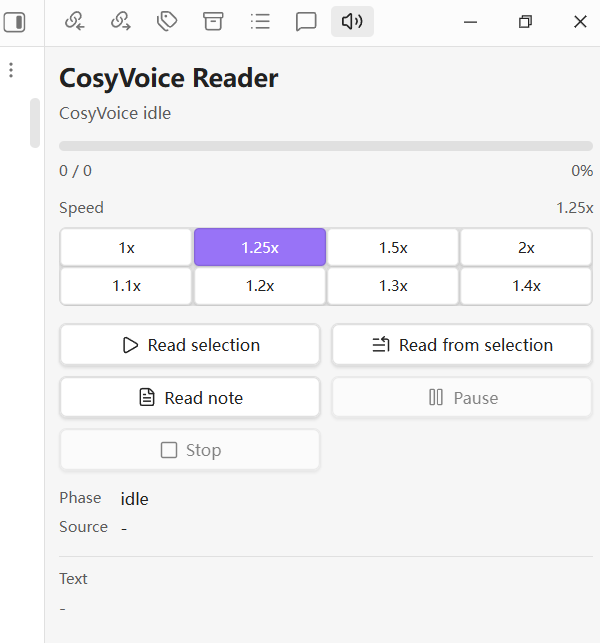
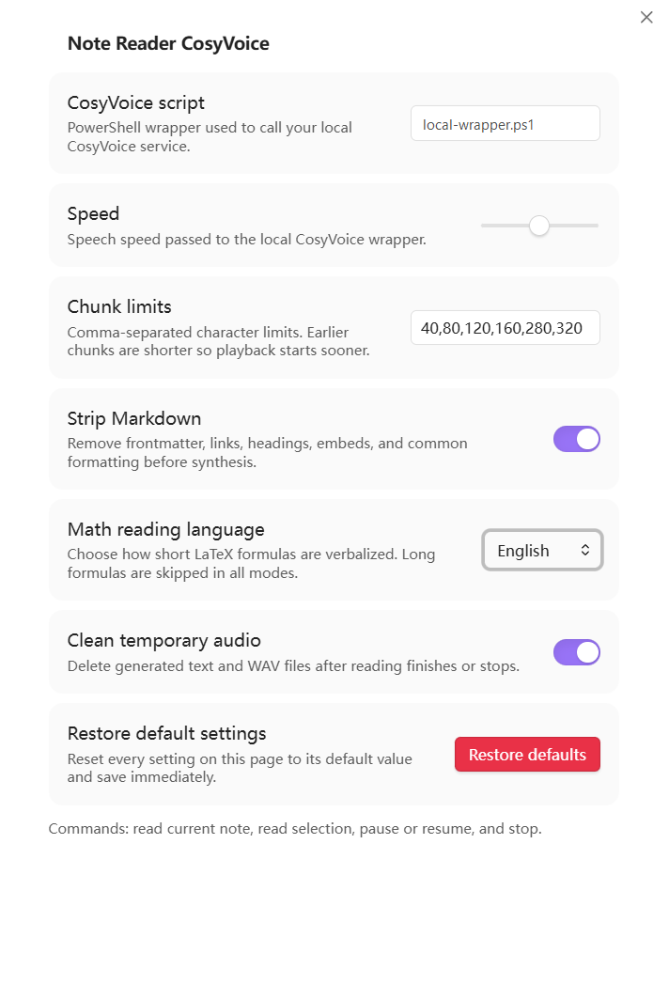

# Note Reader CosyVoice

[English README](README.md)

Note Reader CosyVoice 是一个桌面端 Obsidian 插件，用于把当前笔记、选中文本，或从选中位置开始的后续内容交给本地 CosyVoice 语音合成流程朗读。插件本身不包含 CosyVoice、语音模型或云端语音服务，它只负责文本清理、分块、调用本地脚本、播放音频和提供控制面板。

## 界面截图

右侧朗读控制面板：



插件设置页。截图中的脚本路径是脱敏示例：



## 功能

- 朗读当前笔记、当前选中文本，或从选中位置开始朗读到笔记结尾。
- 在右侧边栏打开 `CosyVoice Reader` 控制面板。
- 显示合成、播放状态、整体朗读进度、百分比和当前文本预览。
- 支持暂停、继续、停止；控制面板获得焦点时可用空格暂停/继续，可连续按左右方向键按 5 秒步进前后跳转；进度条两侧提供上一段/下一段按钮；也支持在当前已加载音频块内点击或拖动进度条。
- 右侧边栏提供语速按钮：`1x`、`1.25x`、`1.5x`、`2x`、`1.1x`、`1.2x`、`1.3x`、`1.4x`。
- 通过本地 PowerShell 包装脚本调用 CosyVoice，不直接使用云端 TTS。
- 在合成前清理 Markdown 和常见 LaTeX 标记。
- 设置页提供 `Restore defaults` 按钮，可以把插件设置恢复为默认值。
- 提供 `Math reading language` 设置：
  - 默认使用 `English`，例如 `$a_b$` 会处理为 `a subscript b`。
  - `Chinese` 会使用中文数学读法，例如 `$a_b$` 会处理为 `a 下标 b`。
  - `Skip math` 会跳过短公式和长公式。
  - 超过 12 个非空白字符的公式会被跳过，避免长公式被逐字朗读。
  - 常见希腊字母命令保留为英文名，例如 `\alpha`、`\beta`、`\pi` 会变为 `alpha`、`beta`、`pi`。
  - 会处理常见非希腊符号和样式命令，例如 `\leq`、`\times`、`\textbf{...}`、`\mathbf{...}`、`\boldsymbol{...}`。
  - 短 `\frac{a}{b}` 在英文模式下处理为 `a over b`，在中文模式下处理为 `a 分之 b`。

## 安全与隐私

插件按本地语音合成场景设计，不会把笔记内容发送到 Microsoft、OpenAI 或其他远程 TTS 服务。文本会先写入插件缓存目录中的临时文本文件，然后传给你在设置中指定的本地 CosyVoice 包装脚本。

需要注意：

- 网络请求：插件本身不直接访问远程服务。你配置的 CosyVoice 包装脚本可能会访问本机服务，例如 `127.0.0.1`。
- Shell 执行：插件会启动你在设置中配置的 PowerShell 脚本，这是调用本地 TTS 运行时所必需的。
- 文件访问：插件会在库内插件目录的 `cache` 文件夹下写入临时文本和 WAV 文件，并检查配置的脚本路径是否存在。
- 遥测：插件不包含客户端或服务端遥测。
- 自动更新：插件不包含自更新机制。

只建议配置你自己检查过的本地脚本。不要把不可信脚本路径填入插件设置。

## 安装插件

1. 从 GitHub Release 下载安装包，或下载 `main.js`、`manifest.json`、`styles.css`。
2. 在你的 Obsidian 库中创建插件目录：

```text
<你的库>/.obsidian/plugins/note-reader-cosyvoice
```

3. 把以下文件放入该目录：

```text
manifest.json
main.js
styles.css
README.md
INSTALL.md
LICENSE
```

4. 重新打开 Obsidian，进入 `Settings -> Community plugins`，启用 `Note Reader CosyVoice`。
5. 进入插件设置，填写本地 CosyVoice 包装脚本路径。

## 本地 CosyVoice 要求

插件要求你先准备好一个本地 CosyVoice 运行环境，并提供一个 PowerShell 包装脚本。插件调用脚本时使用以下参数：

```powershell
cosyvoice-wrapper.ps1 -InputPath <txt> -OutputPath <wav> -Speed <speed>
```

脚本需要做到：

- 读取 `InputPath` 指向的 UTF-8 文本文件。
- 调用你的本地 CosyVoice 运行时生成语音。
- 把有效 WAV 文件写入 `OutputPath`。
- 成功时退出码为 `0`。
- 失败时输出清晰的错误信息。

推荐脚本路径：

```text
%LOCALAPPDATA%\note-reader-cosyvoice\cosyvoice-wrapper.ps1
```

你也可以使用其他路径，只要在插件设置页中正确填写即可。更完整的本地安装、硬件建议、系统建议和脚本示例见 [Local CosyVoice setup](docs/local-cosyvoice-setup.md)。

## 模型存储空间、其他语音模型与 Chunk limits

插件不会下载模型。安装本地语音模型前，需要先为模型、运行环境和缓存预留磁盘空间：

- 当前常见 CosyVoice 模型仓库通常是数 GB 级别。截至 2026-06，公开 Hugging Face 示例中，300M 模型约 `2.5 GB`，0.5B CosyVoice3 模型约 `9 GB`。
- 实际占用会大于模型文件本体，因为还包括 Git LFS 或下载缓存、Conda/Python 环境、依赖、日志和多个模型副本。单模型建议至少预留 `10-20 GB`，如果要同时保留多个模型或实验环境，建议预留 `30 GB+`。
- 模型和缓存建议放在本地 SSD 上，不建议放在会自动同步的大型网盘目录中。

这个插件名字里包含 CosyVoice，但底层只要求“输入文本文件、输出 WAV 文件”的包装脚本。因此也可以接入其他本地语音模型，只要脚本满足同一调用约定：读取 `-InputPath` 的 UTF-8 文本，把有效 WAV 写到 `-OutputPath`，接受 `-Speed` 参数，失败时返回非零退出码并输出清晰错误。更换模型时需要注意模型许可证、中文/英文支持、输出音频格式、语速控制方式、首次启动延迟，以及是否会把文本发送到本机以外的服务。

`Chunk limits` 用来控制文本分块大小。它影响首段音频出现速度、合成稳定性和朗读连贯性：

- CPU-only 或低性能 GPU：可从 `30,60,90,120,160,200` 开始。
- 中端 GPU：建议先使用默认值 `40,80,120,160,280,320`。
- 性能较好的 GPU 或稳定的本地低延迟服务：可尝试 `80,140,220,320,480,640`。
- 如果合成超时、失败或第一段音频等待太久，就把数值调小；如果朗读过于碎片化且模型稳定，再逐步调大。

## 本地模型与系统建议

插件不决定硬件需求，真正的资源占用取决于 CosyVoice 运行时、模型大小和部署方式。

- CPU-only：适合测试短句，正式朗读长笔记通常会比较慢。
- NVIDIA GPU：更适合日常朗读，尤其是长文本或频繁使用。
- Windows：建议把 CosyVoice 运行在 WSL2 或 Linux 环境中，再通过本地 HTTP 服务让 PowerShell 脚本调用。
- Linux：通常是部署 CosyVoice 最直接的环境。
- macOS：如遇到本地部署困难，可以考虑在 Linux 主机或局域网服务器上运行 CosyVoice，再通过本地或局域网接口调用。

部署 CosyVoice 时应优先参考上游项目的当前说明：

- CosyVoice: `https://github.com/FunAudioLLM/CosyVoice`
- FastAPI runtime: `https://github.com/FunAudioLLM/CosyVoice/tree/main/runtime/python/fastapi`

## 使用方式

插件提供以下命令：

- `Open CosyVoice reader controls`
- `Read current note with CosyVoice`
- `Read selection with CosyVoice`
- `Read from selection with CosyVoice`
- `Pause or resume CosyVoice reading`
- `Stop CosyVoice reading`

也可以使用编辑器中的按钮或右侧边栏控制面板。语速按钮会影响后续合成的音频块；已经合成并正在播放的音频不会被重新变速，除非停止后重新开始朗读。

## 键盘与进度条说明

右侧边栏 `CosyVoice Reader` 控制面板获得焦点时，空格可以暂停或继续朗读，连续按左方向键或右方向键会按 5 秒步进后退或前进。方向键跳转范围限制在当前已加载音频块内。

进度条两侧的三角按钮可以跳到上一段文本分段或下一段文本分段。已经合成过的分段会尽量复用；如果目标分段尚未合成，插件会先合成再播放。

右侧边栏进度条显示的是整段朗读任务的整体进度。播放时可以点击或拖动进度条，但跳转范围受当前已加载音频块限制。如果拖动到当前音频块外，插件会自动夹到当前块边界。

## 常见问题

- 提示脚本不存在：检查插件设置中的脚本路径是否正确。
- 提示无法朗读：先在 PowerShell 中单独测试包装脚本，确认它能生成有效 WAV 文件。
- 生成速度慢：本地模型首次加载和首次推理可能较慢，CPU-only 环境也会明显变慢。
- 语速按钮无效：检查你的包装脚本或本地服务是否真正使用了 `-Speed` 参数。
- 公式朗读不符合预期：在插件设置中切换 `Math reading language`，或使用 `Skip math` 跳过公式。

## 共享包内容

安装包只应包含：

- `manifest.json`
- `main.js`
- `styles.css`
- `README.md`
- `INSTALL.md`
- `LICENSE`

不要打包 `data.json`、`cache`、`last-error.log`、本地测试文件或任何包含个人路径、密钥、令牌的信息。

## 许可证

MIT.
