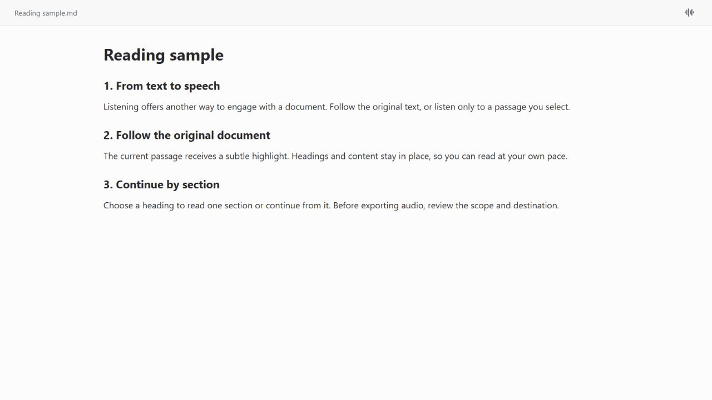
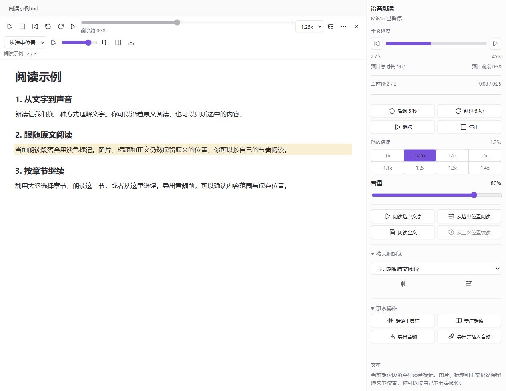
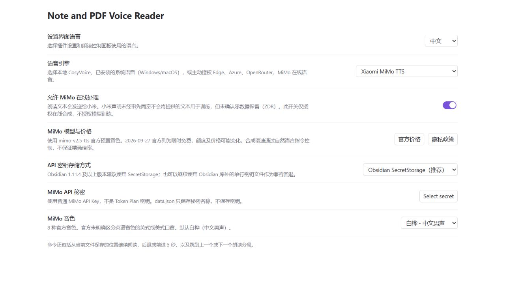
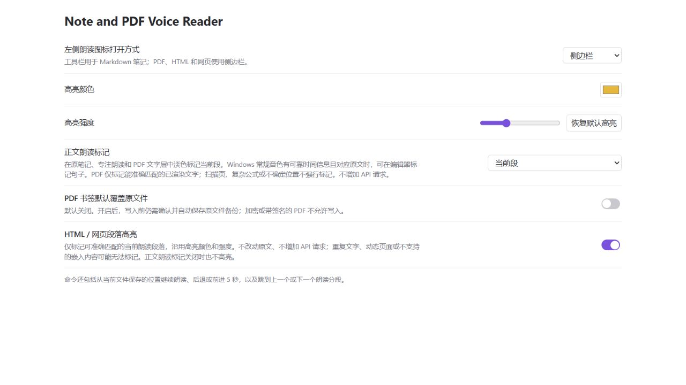
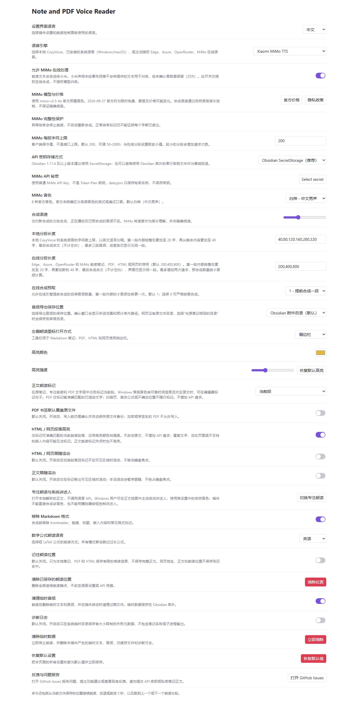

# Note and PDF Voice Reader

**语言：** [English](README.md) | 简体中文 | [Deutsch](README.de.md) | [Français](README.fr.md) | [Русский](README.ru.md) | [한국어](README.ko.md) | [日本語](README.ja.md) | [Español](README.es.md) | [Italiano](README.it.md) | [Português](README.pt.md)

在 Obsidian 中朗读 **笔记、PDF、HTML 文件和网页**。一边听，一边在原文中跟读；也可以按章节跳转，或导出音频稍后收听。

**一键展开朗读工具栏：** 点击内容窗口右上角的朗读图标，显示或收起原文上方的播放器。



动图使用当前插件界面代码和公开示例制作，界面为英文；实际外观随主题变化。

## 核心亮点

- **隐私由你掌握。** 正文在本地解析，在线朗读需主动授权；使用已安装的离线系统音色或本地 CosyVoice 时，语音合成也在本机完成。
- **从想读的位置开始。** 支持全文朗读、仅朗读选中文字，以及从选中位置继续朗读，PDF 同样适用。
- **保留原文排版，轻松跟读。** 支持笔记／实时预览、文本型 PDF、HTML 和网页的可选高亮，可调颜色与浓度，并适配常见双栏 PDF 论文的阅读顺序；工具栏直接显示在原内容视图中。
- **把 Copilot 回答听下来。** 朗读已保存对话的最新回复、最近两条回复或一轮问答。可先选择与预览，也可右击工具栏聊天图标，直接播放最近保存对话的最新回答。
- **按大纲阅读。** 使用笔记标题、PDF 书签或本地推断的 PDF 标题，并识别 HTML 标题与连贯的章节编号；可朗读本节或从本节继续。
- **面向论文的学术阅读。** 可跳过复杂 LaTeX 公式和长数字表格，使用 sub、bar 等简洁符号读法，合并连续文献引用；保留短公式、小表与正文，PDF 采用保守识别。
- **尽快开始播放。** 渐进解析与短启动音频减少等待，PDF 后续页面可以在开始播放后继续解析。
- **减少不必要的额度消耗。** 在线播放默认只提前合成一个后续音频片段，也可关闭预合成；导出音频必须先确认。
- **把朗读保存下来。** 导出全部、选中或剩余内容，也可插入 Markdown 笔记；若最后拼接失败，可复用已有音频重试，不必再次合成。

文本型 PDF 指含有可选中文字的 PDF，扫描件需先做 OCR。高亮和自动大纲受文档结构影响，不能保证所有版式都准确；句级高亮需要可靠时间信息，其他引擎主要按朗读分段高亮。

## 先选一种适合你的语音方式

不必把所有引擎都配置一遍。初次使用，按最关心的需求选择即可。

| 你更看重什么 | 建议先试 | 需要准备 | 需要知道 |
| --- | --- | --- | --- |
| 先免费试用中文或英文朗读 | **小米 MiMo** | 普通 MiMo API 密钥 | 目前限时免费；在线处理，未确认 ZDR |
| 不申请 API 密钥，使用丰富的在线音色 | **Edge TTS** | 安装第三方 `edge-tts` 程序 | 在线处理，插件调用无明确 ZDR 保证 |
| 配置最少，离线使用 | **系统本地语音** | 已安装且兼容的 Windows/macOS 音色 | 不消耗语音 API 额度，音质取决于音色 |
| 不装辅助程序，比较多种语音模型 | **OpenRouter TTS** | API 密钥和可用账户额度 | 按模型付费，强制 ZDR 路由 |
| 使用本地模型，正文不交给云端合成 | **本地 CosyVoice** | 本地运行环境、模型和包装脚本 | 配置较多，占用本机计算资源 |
| 已有微软云服务资源 | **Azure Speech** | Speech 资源、区域和密钥 | 需配置云资源，受服务额度约束 |

截至 **2026-10-04**，[小米官方定价](https://mimo.mi.com/docs/zh-CN/price/pay-as-you-go)仍将 `mimo-v2.5-tts` 列为限时免费，价格、额度和可用性可能变化。音质感受因语言、音色和内容而异，建议先用一小段非敏感文字试听。

## 快速开始

### 安装插件

在 **Obsidian 桌面版**中安装并启用 [Note and PDF Voice Reader](https://community.obsidian.md/plugins/note-reader-cosyvoice)，然后打开插件设置。手动安装见 [INSTALL.md](INSTALL.md)。

初始引擎是需要额外配置的本地 CosyVoice。**第一次朗读前，请先选好下面的一种引擎。** 每种在线引擎都需要单独授权。

### 1. 小米 MiMo：方便尝试中文朗读

1. 在 [MiMo 控制台](https://platform.xiaomimimo.com/)创建**普通 API 密钥**，不要使用 Token Plan 密钥。
2. 将语音引擎设为 **Xiaomi MiMo TTS**，通过 **Obsidian SecretStorage** 保存密钥。
3. 阅读隐私提示，开启“允许 MiMo 在线处理”。
4. 保留默认的**白桦男声（支持中文和英文）**或选择其他音色，先朗读一小段选中文字。

MiMo 会将文字发送给小米。[隐私政策](https://privacy.mi.com/XiaomiMiMoPlatform/zh_CN/)说明未经事先同意不将所提供文本用于训练，但这**不等于零数据留存保证**。

### 2. Edge TTS：无需 API 密钥的在线音色

1. 使用 `pipx install edge-tts` 安装第三方 [`edge-tts`](https://github.com/rany2/edge-tts)。尚未安装 Python/pipx 时，按[详细安装说明](#microsoft-edge-在线语音模式)操作。
2. 选择 **Microsoft Edge 在线语音**，开启“允许 Edge 在线处理”，将“Edge TTS 可执行程序”设为 `edge-tts` 或其完整路径。
3. 选择音色，朗读一小段文字测试。

该辅助程序不是插件自带组件，也不是离线模型。**程序在本地运行，文字仍会发送到在线服务，所用接口未明确保证插件请求的 ZDR。**

### 3. 系统语音：不用密钥，不消耗云端语音额度

1. 选择**系统本地语音（Windows/macOS）**。
2. 选择“系统默认”或检测到的已安装音色；安装新音色后点击“刷新”。
3. 先试听，再开始朗读。

使用兼容的离线音色时，不会将朗读文字发送给 TTS 服务商。**Windows 讲述人的 Natural / Natural HD 自然音色不能通过本插件的系统合成接口调用**；普通已安装音色可以使用，音质因音色而异。下载音色及讲述人辅助用法见后面的详细参考。

### 4. OpenRouter：不用本地辅助程序，按需选择模型

1. 创建 [OpenRouter API 密钥](https://openrouter.ai/settings/keys)，设置消费上限，并确保账户有可用额度。
2. 选择 **OpenRouter TTS**，通过 **Obsidian SecretStorage** 保存密钥，开启“允许 OpenRouter 在线处理”。
3. 选择模型及其对应音色。长篇朗读或导出前，先用一小段文字试听。
4. 对私密内容，保持账户级日志记录和数据共享关闭。

插件始终要求 ZDR 并拒绝服务商数据收集；没有符合条件的路由时，不会自动降低隐私要求。文字仍经过 OpenRouter 和符合条件的上游服务商，不等于本地处理。不同模型的音色与价格各不相同。

### 5. 自带语音 API（BYOK）

选择 **自定义语音 API（BYOK）**，添加配置，再选择 **OpenAI-compatible、ElevenLabs 或 MiniMax**。每个配置单独保存模型、音色 ID 和密钥关联。OpenAI 兼容服务必须兼容**语音合成接口**，仅兼容聊天接口不能使用；请填写完整 HTTPS 语音地址。ElevenLabs 使用官方地址，MiniMax 可选国际站或国内站，需使用对应账户的密钥。

1. 填写模型和账户可用的音色 ID；旁边的文档按钮可打开官方接口说明。
2. 选择 Obsidian 秘密存储中的密钥，或指定库外单行密钥文件。不要把密钥粘贴到地址或模型字段。
3. 核对目标地址，开启 **允许此配置处理朗读文本**，确认文本传输、费用、训练及留存风险。该确认**不代表 ZDR 或不训练认证**，也不会自动套用 OpenRouter 的 ZDR 路由策略。
4. 先用固定短句“试听”，再决定是否朗读敏感内容；试听会消耗账户额度并替换当前播放。

更改接口类型或地址会清除密钥关联；更改模型、音色或密钥选择需重新确认授权。撤销授权会停止正在进行的 BYOK 任务。朗读和导出使用 MP3，倍速在本地调节，沿用在线分段与预合成设置，额外默认每段最多 800 字符，可自行调小。失败请求**不自动重试**。暂不包含 Google Cloud、AWS Polly、任意请求脚本、音色克隆或非语音类 OpenAI 兼容接口。

接口参考：[OpenAI](https://developers.openai.com/api/docs/guides/text-to-speech)、[ElevenLabs](https://elevenlabs.io/docs/api-reference/text-to-speech/convert)、[MiniMax](https://platform.minimax.io/docs/api-reference/speech-t2a-http)。

授权开关位于“接口配置”下方，显示当前授权状态和目标地址；本模式的风险提示可展开“BYOK 数据处理与费用风险”查看。“查看通用隐私说明”可跳转至“隐私与帮助”，其中的共同说明适用于所有语音模式，而非 BYOK 独有。默认配置名称随接口类型更新；手动命名后保留原名称，并在下拉列表中同时标明接口类型。

### 开始听

打开笔记、文本型 PDF、本地 HTML 或已加载的 Web viewer 网页，打开朗读侧边栏或工具栏，选择“全文”“仅选中内容”或“从选中位置”，然后开始播放。

**本地 HTML 的准备：** 先在 **设置 → 第三方插件 → 浏览** 中搜索、安装并启用 [HTML Reader](https://community.obsidian.md/plugins/obsidian-html-plugin)，再用它打开库内的 `.html` 或 `.htm` 文件。HTML 选中文字、从选中位置朗读，以及原页面工具栏、高亮和大纲定位需要 HTML Reader；全文文本解析本身不依赖这个显示插件。外部网页使用 Obsidian 内置 **Web viewer**，不需要 HTML Reader。

暂停／继续、播放倍速、音量、上一段／下一段和进度跳转都可在播放器中操作，改变播放倍速不需要重新合成。导出时先核对范围、字符数与保存位置，再确认开始。

**工具栏快捷键（0.8.1）：** **空格**暂停／继续，**左／右方向键**后退／前进 5 秒，支持跨音频片段跳转。实时预览和编辑模式仅在工具栏或其按钮获得焦点时启用，可点击播放控制按钮或工具栏空白处聚焦；Markdown 阅读模式在工具栏打开时，原正文区域也可使用。输入框、滑块、下拉菜单和带修饰键的组合保留原有操作。悬停暂停／继续和前后跳转按钮可查看快捷键提示。

## 界面预览

以下为使用当前插件界面代码和公开示例文字制作的展示图，密钥选择为空；实际外观会随 Obsidian 主题变化。

<details>
<summary>展开完整正文与侧边栏截图</summary>



</details>

**语音配置：** 引擎选择、在线授权与 MiMo 默认音色。



**阅读偏好：** 高亮、在线预合成与 PDF 书签保存设置。



<details>
<summary>展开完整设置页面截图</summary>



</details>

## 更严格的隐私需求与进阶配置

**希望正文不交给云端合成？** 最方便的是使用已安装的离线系统音色；也可以配置[本地 CosyVoice](docs/local-cosyvoice-setup.md)。后者需要先安装并测试运行环境和模型，再选择“本地 CosyVoice”，填写兼容包装脚本的路径。保持在线授权关闭，并确认本地运行环境与脚本可信。

**已经使用 Azure？** 选择 **Microsoft Azure Speech**，填写 Speech 资源对应的云和区域，通过 SecretStorage 保存密钥，开启 Azure 在线处理。详见 [Azure 配置](#microsoft-azure-speech-模式)。

语音服务、临时音频、导出附件和库同步各有不同的隐私边界，选择某个引擎并不能自动保证整个流程绝对私密。具体说明与更多配置放在下方，按需查阅即可。

## 详细参考

<details>
<summary>展开功能细节、隐私说明、完整配置与开发资料</summary>

### 系统音色详细说明

1. 在插件设置中选择 **系统本地语音（Windows/macOS）**。已有兼容音色时，无需 API 密钥、额外 TTS 程序或模型下载。
2. 保留 **系统默认（已安装音色）**，或选择检测到的音色。安装更多音色后点 **刷新**；**试听**使用固定测试文字，不上传笔记。Windows 和 macOS 的音色选择分别保存。
3. 沿用现有朗读、暂停、跨段跳转、进度拖动和确认后的分范围导出。系统语音按正常语速生成 PCM WAV；面板调节的是播放倍速和音量，无需重新合成。导出的音频保持正常语速。

**可选下载 Windows 音色：** 本插件使用的普通系统音色可通过 **设置 → 时间和语言 → 语音 → 管理语音 → 添加语音** 安装，之后刷新插件列表。仅供讲述人使用的音色另行下载：新版 Windows 11 为 **设置 → 辅助功能 → 讲述人**（或按 `Win+Ctrl+N`）→ **讲述人的声音 → 添加语音 → 添加**；旧版界面可能显示 **添加自然语音** 或 **添加旧版语音**。参见[微软帮助](https://support.microsoft.com/en-us/accessibility/windows/narrator/appendix-a-supported-languages-and-voices)。**当前插件不能直接调用讲述人的 Natural / Natural HD 自然音色合成音频，即使已下载安装也不例外。** 微软目前尚未提供可供本插件受支持地调用这些讲述人音色的公开接口；Windows 系统语音模式使用 SAPI，并非讲述人。刷新或重复下载不能解锁。替代方式是使用下述独立的 **朗读正文** 视图配合系统讲述人。不建议修改注册表强行开放。此限制不针对 macOS 音色或微软在线语音服务。

macOS：**系统设置 → 辅助功能 → 朗读与说话**（旧版为 **朗读内容**）→ **系统声音 → 管理声音 / 下载**，下载所需语言及可用的增强音色，再刷新插件。不同版本名称可能不同，参见[苹果官方步骤](https://support.apple.com/guide/mac-help/change-the-voice-your-mac-uses-to-speak-text-mchlp2290/mac)。仅供 Siri 使用的音色可能不会出现在 `say` 列表中。

**隐私边界：** 使用已安装的离线音色时，与本地 CosyVoice 类似，正文在本机合成；此模式不会把朗读正文发送给在线 TTS、安装音色包或回退到云端。音色下载需要联网，且由用户在系统设置中主动操作。相对于在线 TTS，文本处理边界更简单，但不能据此保证所有系统遥测或第三方音色引擎的行为；导出音频、库同步也需要单独考虑。临时文本和音频仍遵循插件清理设置，不消耗在线 API 额度。音质和语言覆盖取决于本机音色，不保证达到云端神经音色效果。Windows 已进行本机合成验证；macOS 的命令和解析有自动测试，仍需 Mac 真机验证。

### 朗读工具栏与专注朗读（0.8.0）

设置中可选择左侧朗读图标打开侧边栏、工具栏或两者同时打开，适用于 Markdown、PDF、HTML Reader 和 Web viewer 窗口。高亮支持颜色选择、5–60% 强度及单独恢复默认。侧边栏提供折叠式大纲，导出及诊断信息收在“更多操作”中。

Markdown 高亮跟随当前实际播放的音频片段，逻辑分段编号保持不变。编辑器中可准确对应原文的内容采用更小范围的标记；阅读视图标记对应自然段或可核对的列表项。统一使用浅色底色，可在“播放与界面”中另外开启左侧标线。公式转换或列表排版不明确时保守回退。编辑笔记后清除失效高亮，每次朗读只提示一次；重新开始朗读即可使用修改后的文本。不额外增加语音请求。

点击控制面板的 **朗读工具栏**、窗口标题栏的音频图标，或执行 **Toggle reading toolbar in current note, PDF, HTML or web page** 命令。工具栏位于原内容上方，保留原有图文、图片和嵌入资源。支持暂停/继续、前后段、前后 5 秒、进度、倍速、音量及三种朗读范围；关闭工具栏不会停止播放。大纲控制支持 Markdown、PDF 和本地 HTML Reader，暂不包括外部 Web viewer 网页。

大纲来自笔记标题：选择标题先定位，再明确点击朗读该节（包含子标题）或从该节继续。更多控制中可选择全文、选中文字或从选中位置开始；导出仍需要确认。笔记编辑后旧定位会失效，避免从错误位置起读。

独立视图保留为 **专注朗读**，适合提取正文及配合系统讲述人。选区朗读按实际选中的位置处理，包括重复出现的文字；渐进载入的 PDF 正文需完整载入后才能从选中位置读到末尾。

**PDF 淡色标记：** 连续行浅色背景跟随当前播放的音频片段，逻辑分段编号保持不变；有可靠句子时间信息时可进一步缩小范围，但不代表逐字同步。先在本地解析的 PDF 原文中唯一锚定完整分段，再把当前范围对应到可见文字层。跨页时，下一页尚未加载也可先标记已显示页面中的可靠范围；定位按钮跟随当前音频片段所在页。缓存页面布局，减少重复计算，并沿用本次朗读的文本处理设置。复杂排版、公式转换或文字层尚未显示时不猜测位置，扫描页需要先 OCR。不上传 PDF、不额外请求语音 API，也不会自动滚动 PDF。

**定位正在朗读的位置：** 点击工具栏倍速右侧或侧边栏进度标题旁的定位图标，即可返回当前原文位置，无需重新开始播放。支持 Markdown、PDF、HTML Reader 和已打开的 Web viewer 网页。只能定位到 PDF 页面或完整分段时会提示；原文已变化或位置不明确时不猜测跳转。

**HTML / 网页高亮：** 独立开关控制 HTML Reader、Web viewer 及其阅读模式中的当前段落高亮，采用统一浅色底色，不重写网页、不替换选中文字。含公式内容通过可核对的原文片段匹配，不代表精确逐词或逐句同步；重复文字、页面变化、不支持的浏览器版本或无法访问的嵌入页面不强行标记。跟随滚动默认关闭，开启后在新段落移出可见区域时滚动。不额外消耗语音 API 额度。

**PDF 大纲与书签：** 优先使用已有书签，否则结合编号和字体在本地识别。可核对、编辑标题与层级，定位、只读本节或从本节继续。拖动标题栏移动面板，“居中”恢复位置；“全选 / 全不选”批量控制写入条目。同一 PDF 未变化时，再次打开会复用已识别的大纲及编辑，缓存仅放内存，最多保留三份且有大小上限。重载插件、清理临时数据、文件变化或缓存被淘汰后重新识别，不把大纲正文写入设置。

**HTML 大纲：** 优先使用 HTML 标题标签，也会保守识别独立、简短、连续且层级完整的 `1`、`1.1`、`1.1.1` 等章节编号。推断条目标为“自动识别”，尽量排除孤立编号、缺失父级、普通列表和年份。可定位、只读本节及子节，或从本节继续。编号本身不能证明是标题，自动识别结果仍需核对。

保存书签需要确认，默认另存副本，也可设置覆盖原 PDF，但覆盖前必须自动备份并校验。已有书签支持保留、合并或替换；加密或带数字签名的 PDF 不允许写入。写入的是 PDF 书签，不是在正文前增加可见目录页，不改变正文排版。

### PDF 脚注

PDF 默认跳过重复的页眉页脚、页码和可靠识别的术语表。可在设置中关闭“跳过 PDF 页眉页脚”，或开启“正文朗读时包含 PDF 术语表”。PDF 工具栏的朗读范围菜单提供“仅朗读术语表（整篇 PDF）”和“仅朗读脚注（整篇 PDF）”，无需改动全局设置；未识别到对应内容时会提示。识别在本地完成，不修改 PDF 文件。仅选中文字时不自动过滤。

**PDF 脚注：** 设置中的“PDF 脚注朗读”默认“只读正文”，也可选择“正文结束后读脚注”“保留原顺序（含脚注）”或“只读脚注”。结合页底编号、字号、间距和可提取的分隔线保守识别，不确定的文字仍保留。完整 PDF 朗读与导出使用该设置；仅朗读或导出选中文字时保留所选内容。识别可能因排版而变化，可用原顺序模式对照检查。

### 朗读 Copilot 已保存的对话

**使用准备：** 请先在 Obsidian 社区插件中安装并启用 **Copilot**，用它创建和保存对话。Copilot 是独立插件，不包含在本朗读插件中，也不是普通笔记、PDF、HTML 或网页朗读的必需依赖。本功能读取已保存的 Markdown 对话文件，因此朗读已有对话时不必保持 Copilot 聊天窗口打开。

在 Copilot 中开启 **Autosave Chat as Markdown**，然后点击工具栏的 **Copilot 聊天朗读** 图标、侧边栏“更多操作”中的 **聊天朗读**，或执行 **Read saved Copilot chat** 命令。选择对话并查看文字预览，可朗读最新一条回复、最近两条回复或最近一轮问答。默认只读 AI 回复，也可选择包含自己的提问。

自动查找仓库中名为 `copilot-conversations` 的目录，也可在朗读插件设置中指定仓库内的自定义目录。当前明确打开的对话笔记可预先选中；无法确定当前对话时，由你选择，不会直接把最近修改的文件当作当前聊天。选择对话后才读取正文，单个文件上限 2 MB；文件变化后需要刷新预览。

快速播放：点击聊天窗口的 **朗读最近回答**，或 **右击工具栏聊天图标**，直接朗读最近修改的已保存对话中最新一条已保存 AI 回答，不包含提问。这里的“最近”不代表当前查看的聊天。该对话没有可读回答时会提示，不会自动换到其他聊天；快捷播放同样使用当前语音引擎和在线处理授权。左键仍打开选择与预览窗口。

按 Copilot 保存的 `user` / `ai` 消息及时间戳分隔解析，已核对 Copilot 4.0.13 的保存格式。过滤上下文元信息、系统和工具消息，以及可识别的思考和工具标记块。尚未保存的回复不可读取；最新提问尚无回复时，不会把它和上一条回答配成一轮。播放沿用现有暂停、倍速、音量和跳转功能，不新增阅读历史锚点，也不在 Copilot 聊天气泡中注入按钮或高亮。

浏览与预览在本地完成，不调用语音 API。点击播放后使用当前语音引擎及已有在线处理授权；在线引擎会收到所选文字，预览窗口会显示去向。此功能可在设置中关闭。

### 专注朗读、淡色标记与 Windows 讲述人

点击控制面板的 **专注朗读**，或执行 **Toggle focus reading / Narrator document** 命令进入；再次点击，或点击视图中的返回按钮退出，返回仍然打开的原笔记，不停止朗读。视图本地载入正文，不调用语音 API 或读取密钥。Markdown 沿用 Obsidian 原生渲染和主题字体，保留标题、列表、强调、公式与表格，可选中和复制文字。图片与嵌入资源不会自动加载，视图内停用可执行代码块处理器与原始 HTML。其他格式展示提取后的正文，而非原页面排版。播放期间复用已有分段队列，PDF 后续解析结果继续追加；不把完整正文另存到插件设置。

- **标记：** 可关闭、标示当前段，或在有可靠时间信息时标示当前句子。原 Markdown 编辑器、实时预览和阅读窗口也支持临时原文块标记，不修改文字、光标或选区。Windows 普通系统音色在同一次合成中取得词语时间边界，精确对应原文时可在编辑器标记句子；原生 Markdown 阅读模式使用块级标记，其他引擎使用段级标记。编辑笔记或无法可靠对应原文时停止原笔记标记，不猜测位置。PDF 标记遵循上方的保守匹配规则。不会为高亮逐句增加 API 请求。
- **跟随：** 默认关闭。仅在新标记移出可见区域时滚动；手动滚动暂停跟随，不抢占键盘焦点。进度更新不会重建正文或破坏选中文字。
- **讲述人：** 先停止插件朗读，在正文视图点击辅助功能图标并确认启动。选择起始段落，按讲述人键（`Caps Lock` 或 `Insert`）+ `R` 从当前位置阅读；`Ctrl` 停止说话；讲述人键 + `Esc` 退出。使用 Windows 讲述人设置中的音色，包括已安装的自然音色。这是无障碍辅助阅读路线，不是插件直接合成：插件的暂停、跳转、音频导出和句子时间线不能控制讲述人。插件不修改注册表、不安装音色包，也不会终止已经运行的讲述人。

Windows WAV 使用 16 kHz 单声道 16 位 PCM，避免普通 SAPI 音色重采样造成的边界时间不匹配；macOS 仍为 24 kHz。时间信息无效或不完整时自动退回段级标记。已用公开中英文测试句实测 Windows 时间边界；macOS 句子同步尚未实现。

### 小米 MiMo TTS 快速开始

MiMo 默认每段最多 200 字符，可在设置中调整（客户端保守措施，并非官方接口上限），更短的用户设置仍保留，可能增加请求次数。生成异常结束或 WAV 文件不完整时会停止，不再自动跳段或重新合成。正常结束标记并不能证明逐字完整；MiMo 当前未提供可供核对的音频转写结果。

1. 在 [MiMo 控制台](https://platform.xiaomimimo.com/)创建普通 API Key，不是 Token Plan 密钥。
2. 在插件设置中选择 **Xiaomi MiMo TTS**，使用 Obsidian SecretStorage 保存密钥；旧版 Obsidian 可使用库外单行密钥文件。
3. 阅读隐私说明，开启 **允许 MiMo 在线处理**。提供 8 种官方音色，默认 **白桦男声（支持中文和英文）**；官方未明确区分这些音色朗读英语时的英式或美式口音。
4. 使用现有按钮朗读或导出笔记/PDF。模型为 `mimo-v2.5-tts`，输出 WAV 音频，沿用在线分块与最多提前预合成一段的限制。合成语速通过自然语言指令控制，不保证精确倍率。

截至 2026-10-04，[官方价格页](https://mimo.mi.com/docs/zh-CN/price/pay-as-you-go)列为**限时免费**，价格及额度可能变化。[隐私政策](https://privacy.mi.com/XiaomiMiMoPlatform/zh_CN/)声明未经事先同意不会将提供的文本用于训练，但**未确认零数据保留（ZDR）**。插件开关仅授权在线合成，不授权训练。MiMo 为独立直连接口，不属于 OpenRouter ZDR 路由；本次不包含音色克隆或音色设计。

## 功能

- 朗读当前 Markdown 笔记、文本型 PDF 或本地 HTML 文件、相应视图中的选中文字，或从选中位置开始朗读到当前文件结尾。HTML 选区与 HTML Reader 配合使用。
- 使用 Obsidian 内置 PDF.js 在本地逐页提取 PDF 文本，利用坐标改善常见双栏页面的朗读顺序，边解析边加入朗读队列，并支持从控制面板停止。
- 分段时优先保留段落、行、句子和分句边界，同时把用户设置的字符数作为不可突破的上限。
- 可以记住并继续 Markdown、PDF 或 HTML 的朗读位置；默认仅本次运行保留，跨重启保留需主动选择，并提供单独的清除记录按钮。
- 可以把 Markdown 笔记、文本型 PDF 或本地 HTML 的全部内容、选中内容或选中位置之后的内容导出为一个音频文件：本地 CosyVoice 和 MiMo 生成 WAV，Edge、Azure 和 OpenRouter 生成 MP3；可保存到 Obsidian 附件目录、源文件同目录或指定的库内目录，Markdown 还可在成功后直接嵌入原笔记。
- 在右侧边栏打开 `Voice Reader` 控制面板。
- 显示合成、播放状态、整体朗读进度、百分比和当前文本预览。
- 支持暂停、继续、停止；控制面板获得焦点时可用空格暂停/继续，可连续按左右方向键按 5 秒步进前后跳转；进度条两侧提供上一段/下一段按钮；也支持在当前已加载音频块内点击或拖动进度条。
- 右侧边栏提供语速按钮：`1x`、`1.25x`、`1.5x`、`2x`、`1.1x`、`1.2x`、`1.3x`、`1.4x`。
- 设置页可以选择 `Local CosyVoice`、`Microsoft Edge online voice`、`Microsoft Azure Speech` 或 `OpenRouter TTS`。默认是本地 CosyVoice。
- 设置页顶部可以在英文和中文之间切换，切换后整页设置名称、说明、选项和按钮都会改用所选语言。
- Edge、Azure 与 OpenRouter 三种在线模式分别设置同意开关，未显式同意时插件不会发送文本。
- 本地与在线模式使用独立分段设置；在线笔记、PDF 和 HTML 默认使用 `200,400,800`，并默认最多提前合成一个后续小音频。MiMo 仍受其额外分段上限约束。
- **智能快速起读**适用于任何尚未合成的播放目标，包括后续段和章节跳转：按整句累加至20字，再从剩余内容累加新的40字，最后合成余文（不计空白）。内部音频共用段号和进度条；已经合成或正在请求的音频直接复用，不重新拆分。正常后台预合成保持原计划，默认最多预合成下一小段音频。每个拆分段最多增加两次请求，实际等待和费用取决于服务商；此选项在下次朗读生效，音频导出仍使用常规分段。
- 可选的**极速起读**允许5～19字的首个完整短句提前播放，随后仍按40字门槛衔接，再合成余文；不符合时沿用标准规则。它替换首个门槛，不额外增加一级：仍最多三小段音频，不增加预合成上限，不拆分已有请求，导出不变。在“播放与界面”中选择关闭、标准起读（默认）或极速起读，下次朗读生效。首个音频较短可能增加衔接等待的机会，实际提速取决于服务商。
- 在 Obsidian 1.11.4 及以上版本中，Azure 和 OpenRouter 密钥默认使用 Obsidian SecretStorage，也可切换到库外密钥文件兼容模式。
- 设置页提供常用中文、粤语、台湾中文和英文音色预设、按 OpenRouter 模型联动的音色目录，也保留自定义 Voice ID。
- 在合成前清理 Markdown 和常见 LaTeX 标记，并把 Markdown 表格转换为适合朗读的列名与逐行字段说明，自动跳过空单元格。
- 将数字引用合并为自然的文献表述：中文正文中 `[3]` 读作“文献3”，`[2][4]` 或 `[2], [4]` 读作“文献2和4”；英文正文使用 reference / references。保留 `[s]`、`[%]` 等单位标记。
- 每个设置分类底部提供需确认的**恢复本页默认设置**；“隐私与帮助”仍保留**恢复全部默认设置**。保留密钥引用、服务配置、界面语言和朗读记录，不删除文件。正在朗读的任务保留其合成配置，下次朗读使用新设置。历史模式恢复为仅本次运行时移除磁盘副本，内存记录保留至退出。
- 设置页提供 [GitHub Issues](https://github.com/laginae/note-reader-cosyvoice/issues) 反馈入口，用于报告问题和提出功能建议。

## 学术阅读

简单公式如 `$z_{\mathrm d}$` 会读作“z sub d”。字体和排版空白不会使简单公式被误判为复杂公式；仍尊重主动跳过公式的设置，并保留复杂公式保护。

设置页按 **语音引擎、播放与界面、学术阅读、导出与存储、隐私与帮助** 五个分类分页显示。紧凑语言选择位于标题旁，窄窗口自动换行；标题和分类栏随页面正常滚动，避免吸顶时露字或遮挡正文。切换分类不会改动设置；更改选项触发刷新后仍停留在当前分类。在线授权和密钥紧邻对应引擎，“恢复全部默认设置”放在隐私与帮助页底部。

设置中单独提供 **学术阅读** 区域，集中管理公式、表格、PDF 脚注、页眉页脚和术语表。处理在本地完成，只调整送去朗读的文字，不修改原文件。Markdown / PDF 文本清理需开启 **移除 Markdown 格式**。

| 设置 | 默认方式 | 可选方式 |
| --- | --- | --- |
| 公式朗读策略 | 智能跳过复杂公式 | 朗读支持的公式；跳过所有已识别公式 |
| 公式读法 | 简洁：`x_i` → `x sub i`，`\bar{x}` → `x bar` | 明确读法：下标 / subscript |
| 表格朗读策略 | 智能跳过长数字表格 | 完整朗读；跳过已识别表格 |
| 简短提示略过内容 | 简短提示“公式略过”等 | 关闭后直接继续正文 |

短分数、平方根、绝对值及常用比较运算符会保守转换。例如 `\frac{1}{2}` 中文读作“2 分之 1”，英文为“1 over 2”。`bar` 表示上划线符号，不默认断言它代表平均值。未知命令、矩阵、积分、求和等复杂公式会略过，不猜读。智能模式按缩短命令名后的复杂度判断，不再机械地使用原始 LaTeX 的 12 字符阈值。“朗读支持的公式”放宽长度限制，但不等于支持任意 LaTeX。

Markdown / HTML 的智能表格策略要求：至少 8 行数据或 48 个非空单元格，同时总计至少 16 个非空单元格，其中数字单元格占比至少 60%。保留表格外的 Markdown 标题及 HTML 表题；小表格、以文字解释为主的术语表仍可朗读。明确选中的 HTML 表格保留数据。

**PDF 的识别边界：** 仅跳过带明确表题、连续数字行的表格数据，无法确定时保留；保留表题，不额外插入略过提示。它不是通用的 PDF 表格或公式识别器，缺少结构的 PDF 公式仍可能被朗读，扫描版仍需 OCR。

界面语言、语音音色、公式语言分别设置。公式转换目前支持中文与英文；新增德、法、俄、韩、日、西、意、葡八种主要设置与播放控件翻译，部分详细帮助和次级对话框仍显示英文。八种新增 README 是简明使用指南，完整配置参考仍为中英文版。

## 安全与隐私

**以下共同说明适用于所有语音模式：**插件不提供用于中转朗读正文或 API 密钥的开发者服务器，也不内置使用情况遥测。在线文本发送至所选语音服务或配置的接口；本地包装脚本、第三方程序的网络行为由它们自身决定。临时文本与音频、配置、导出文件、可选续读记录和诊断日志可能保存在本地，临时文件按清理设置删除。服务商的留存和训练政策需另行核实，撤销授权不能收回已经发送的数据。设置中的“隐私与帮助”页顶部提供相同的通用说明。

**BYOK：**文本及所选密钥会直接发送到配置的 HTTPS 地址，服务可能继续把文本转发给上游。请自行核对服务商、中转服务及账户政策；插件无法核实或强制“不用于训练”或“零数据保留”。授权默认关闭，且与具体配置绑定，不跟随 HTTP 重定向。密钥从秘密存储或库外文件读取，不写入接口配置。导出仍须逐次确认；BYOK 合成失败时不会自动重试。

插件默认使用本地语音合成。在 `Local CosyVoice` 模式下，插件本身不会把笔记内容或从 PDF 提取的文本发送到 Microsoft、OpenAI 或其他远程 TTS 服务；但你配置的包装脚本属于同一信任边界，它仍可能按照自身实现发起网络请求。

PDF 提取使用 Obsidian 内置 PDF.js 和 `Vault.readBinary`，此功能不会上传 PDF 文件本身。为支持 PDF 选择位置命令，插件只在内存中临时保留所选页码、页内相对坐标和最多 2,000 个字符的定位文本；这些选区定位信息都不会写入设置或诊断日志。如果选择在线语音引擎并开启对应同意开关，从 PDF 提取出的文本分段会按照与笔记文本相同的规则发送。扫描版或纯图片 PDF 必须先完成 OCR 才能朗读。

HTML 正文通过随插件打包的静态解析库提取，解码字符实体并过滤脚本、样式、嵌入框架、表单、导航、页脚及明确隐藏的元素；文字提取本身不会执行 HTML 或请求资源。HTML Reader 自身显示页面时的安全设置和资源加载属于另一条边界，不由本插件改变。HTML 选区、正文和定位偏移只临时保存在内存中，不写入设置或诊断日志。在线引擎获得授权后，只接收所选范围内的可朗读文字，不上传 HTML 源文件或页面资源地址。开启续读记录后，可以按与笔记相同的规则保存不超过 180 字符的 HTML 短锚点。

`记住朗读位置` 提供**关闭、仅本次运行（默认）、跨重启保留**。仅本次运行的记录只放内存，重载插件或退出后清空；旧版已开启持久保存的用户保留原选择。只有跨重启保留模式会把文件路径、文件时间、PDF页码或分段序号、内部音频序号、播放时间，以及最多180字符的文本定位片段写入 `data.json`。这些仍属于敏感元数据，但不包含音频或完整正文。切换为关闭或仅本次运行会移除磁盘副本，已有内存记录保留至退出或主动清除。清除历史不删除导出文件或密钥。

切换笔记页面会保存当前位置，但不会自动打断播放；开始另一篇朗读时才保存并停止旧任务，临时音频按清理设置处理。重新打开文件不会自动播放，可选“继续上次朗读”或从头朗读；明确指定选中文字或选中位置时优先执行当前选择。同一条仍在运行的音频可以精确继续，音频已清理或插件重启后则重新从保存的段首合成，不套用可能失准的旧音频时间。

Edge、Azure 与 OpenRouter 都是主动选择的在线模式。Edge 模式把每个文本分段交给配置的 `edge-tts` 程序；Azure 模式通过 HTTPS 把分段发送到所选云环境和区域下的 Azure Speech 资源；OpenRouter 模式把分段发送到 OpenRouter 及符合条件的上游 TTS 供应商。三种模式都必须先分别开启在线处理同意开关。OpenRouter 的同意开关只表示允许在线传输，不表示允许非 ZDR 路由。默认情况下，插件可能在播放当前分段时提前合成下一段，但不会提前超过一段；提前停止时最多可能留下一个未播放的预合成分段。把预合成设为 `0` 后可严格按需合成。不同服务的计费单位并不相同，因此这一机制只能限制可避免的额外工作，而不是保证固定比例的费用下降。

每次音频导出都会再次要求确认。对于 PDF 全部导出或从选中位置导出，插件会先完成本地解析与选区定位，再显示确认窗口。窗口会列出所选范围、清理后的可朗读字符数、准确的计划分段数和预计库内路径；使用在线引擎时，只会把该范围内的可朗读文本按顺序发送，可能消耗服务商额度或产生费用。临时失败仍可能触发有限重试，因此实际网络尝试次数可能高于计划分段数。导出不会为播放连续性额外预合成，只有全部分段和后处理成功后才会创建库内音频附件，也可以随时用 `Stop` 取消。

临时文本和音频存放在操作系统临时目录下按 Obsidian 库隔离的子目录中，不再写入库内。启用 `Clean temporary audio` 时，明文分段在完成合成后立即删除，朗读结束或停止时删除其余会话文件，插件启动时还会清理遗留文件和旧版库内缓存。唯一有意保留的情况是：所有导出分段均已合成，但拼接或附件后处理失败；此时音频分段会在当前插件会话中暂存，使 `Retry merge only` 能够复用而不再次调用 TTS。重试成功、执行“清除临时数据”，或在默认清理开启时卸载插件，都会删除这些分段。诊断日志默认关闭；即使开启，也只记录有大小上限的失败元数据，不记录笔记名、笔记文本或子进程输出。

在 Obsidian 1.11.4 及以上版本中，Azure 和 OpenRouter 密钥默认使用 Obsidian SecretStorage。插件的 `data.json` 只保存所选 Secret 的标识符，不保存密钥值。Obsidian 官方把 SecretStorage 说明为按库区分的本地保密存储；不能据此宣称它一定使用 Windows 凭据管理器或 macOS Keychain。插件仍保留“库外单行密钥文件”兼容模式，已有密钥文件配置升级后会继续使用原模式。参见 [Obsidian SecretStorage 官方指南](https://docs.obsidian.md/plugins/guides/secret-storage)。

Microsoft 说明其实时文本转语音接口不保留输入文本或生成音频；但文本仍会传输到所选 Azure Speech 服务并由其处理。使用前还应确认所选云环境和订阅适用的条款。参见 [Azure Speech 文本转语音数据隐私与安全](https://learn.microsoft.com/zh-cn/azure/ai-foundry/responsible-ai/speech-service/text-to-speech/data-privacy-security)。

每个 OpenRouter 请求都强制携带 `provider.zdr: true` 和 `provider.data_collection: "deny"`；如果没有满足条件的端点，合成会直接失败，不会降低隐私策略。OpenRouter 说明请求正文默认不保存，除非账户主动开启输入输出日志或数据共享；但其仍会保存不含正文的请求元数据。朗读私密内容前应确认这些账户开关保持关闭。参见 [OpenRouter 数据收集说明](https://openrouter.ai/docs/guides/privacy/data-collection)和[零数据保留说明](https://openrouter.ai/docs/guides/features/zdr)。

需要注意：

- 网络请求：本地模式启动你配置的包装脚本；Edge 模式使用 `edge-tts`；Azure 模式使用根据所选云环境和合法区域生成的官方地址；OpenRouter 模式固定使用 `https://openrouter.ai/api/v1/audio/speech`。
- Shell 执行：本地模式启动配置的 PowerShell 包装脚本，Edge 模式启动配置的 `edge-tts` 可执行文件；Azure 和 OpenRouter 模式不启动 Shell 命令。
- 存储访问：插件在操作系统临时目录下写入临时文件；本地模式检查包装脚本，Azure 与 OpenRouter 模式从 Obsidian SecretStorage 或配置的库外密钥文件读取凭据。
- 遥测：插件不包含客户端或服务端遥测。
- 自动更新：插件不包含自更新机制。

只建议配置你自己检查过的本地脚本。不要把不可信脚本路径填入插件设置。

## 共享架构

不依赖平台的文本清理、语义分段、PDF 坐标排序、朗读位置锚点和播放状态位于独立的 [`note-reader-core`](https://github.com/laginae/note-reader-core) 仓库。本桌面仓库继续负责文件系统、子进程、本地 CosyVoice、`edge-tts`、音频拼接和导出；独立的 [`note-reader-mobile`](https://github.com/laginae/note-reader-mobile) 插件复用同一核心，但不包含桌面 API 或本地可执行程序调用。

## 安装插件

1. 从 GitHub Release 下载安装包，或下载 `main.js`、`manifest.json`、`styles.css`。
2. 在你的 Obsidian 库中创建插件目录：

```text
<你的库>/.obsidian/plugins/note-reader-cosyvoice
```

3. 把以下文件放入该目录：

```text
manifest.json
main.js
styles.css
README.md
INSTALL.md
LICENSE
```

4. 重新打开 Obsidian，进入 `Settings -> Community plugins`，启用 `Note and PDF Voice Reader`。
5. 进入插件设置，选择 `Speech engine`。默认本地模式需要填写 CosyVoice 包装脚本路径；Edge 模式需要安装 `edge-tts`；Azure 模式需要 Azure Speech 资源及 SecretStorage 或库外密钥文件；OpenRouter 模式需要 OpenRouter 账户、额度及 SecretStorage 或库外 API 密钥文件。

## 本地 CosyVoice 要求

如果使用默认的 `Local CosyVoice` 模式，需要先准备好一个本地 CosyVoice 运行环境，并提供一个 PowerShell 包装脚本。插件调用脚本时使用以下参数：

```powershell
cosyvoice-wrapper.ps1 -InputPath <txt> -OutputPath <wav> -Speed <speed>
```

脚本需要做到：

- 读取 `InputPath` 指向的 UTF-8 文本文件。
- 调用你的本地 CosyVoice 运行时生成语音。
- 把有效 WAV 文件写入 `OutputPath`。
- 成功时退出码为 `0`。
- 失败时输出清晰的错误信息。

推荐脚本路径：

```text
%LOCALAPPDATA%\note-reader-cosyvoice\cosyvoice-wrapper.ps1
```

你也可以使用其他路径，只要在插件设置页中正确填写即可。更完整的本地安装、硬件建议、系统建议和脚本示例见 [Local CosyVoice setup](docs/local-cosyvoice-setup.md)。

## Microsoft Edge 在线语音模式

如果在设置页把 `Speech engine` 改为 `Microsoft Edge online voice`，插件会跳过本地 CosyVoice 脚本，直接调用 `edge-tts` 生成 MP3 音频。你需要先安装 `edge-tts` CLI，并让 Obsidian 能通过 PATH 或绝对路径找到该程序。

[`edge-tts`](https://github.com/rany2/edge-tts) 是发布在 [PyPI](https://pypi.org/project/edge-tts/) 上的第三方 Python 包，用来调用 Microsoft Edge 的在线文本转语音服务。它不是本插件自带的程序，也不是本地离线语音模型。

推荐使用 `pipx` 安装命令行工具：

```powershell
pipx install edge-tts
```

如果还没有安装 `pipx`：

```powershell
py -m pip install --user pipx
py -m pipx ensurepath
```

然后重新打开 PowerShell，再运行 `pipx install edge-tts`。

如果你直接管理 Python 包，也可以使用：

```powershell
py -m pip install --user edge-tts
```

安装后重新打开 PowerShell，先确认命令可用：

```powershell
edge-tts --help
```

列出可用语音：

```powershell
edge-tts --list-voices
```

然后进入 `Settings -> Note and PDF Voice Reader`：

1. 把 `Speech engine` 改为 `Microsoft Edge online voice`。
2. 开启 `Allow Edge online processing`。
3. 在 `Edge TTS executable` 中填写 `edge-tts` 或可执行文件的绝对路径。
4. 从常用音色中选择，或填写自定义 Voice ID。
5. 按需调整 `Speed`。插件会把它转换为 `edge-tts --rate` 参数。

常用音色包括中文女声 `zh-CN-XiaoxiaoNeural`、`zh-CN-XiaoyiNeural`，中文男声 `zh-CN-YunxiNeural`、`zh-CN-YunyangNeural`，粤语 `zh-HK-HiuMaanNeural`，台湾中文 `zh-TW-HsiaoChenNeural`，以及英文 `en-US-JennyNeural`、`en-US-GuyNeural`、`en-US-AriaNeural`、`en-GB-SoniaNeural`、`en-GB-RyanNeural`。Edge 与 Azure 的新默认音色均为英式男声 `en-GB-RyanNeural`，更偏克制的长文与学术朗读。完整 Edge 音色列表以本机 `edge-tts --list-voices` 输出为准。

如果 Obsidian 找不到 `edge-tts`，请在插件设置中填写绝对可执行文件路径并完全重启 Obsidian。除非你明确决定信任并维护该安装，否则不要依赖其他应用的私有虚拟环境。

隐私提醒：Edge 模式会把每个文本分段发送给 Microsoft Edge TTS。Microsoft 的 Edge 大声朗读隐私文档说明，在线转换使用的文本和生成音频会在转换完成后立即删除；但本插件使用的第三方 `edge-tts` 调用接口没有为插件请求提供明确的 ZDR 保证。应把它视为没有可保证 ZDR 控制的在线处理方式；私密或敏感笔记建议继续使用默认的 `Local CosyVoice`。参见 [Microsoft Edge 中的用户数据和隐私](https://learn.microsoft.com/zh-cn/microsoft-edge/privacy-whitepaper/)。

## 保存 Azure 与 OpenRouter 密钥

在 Obsidian 1.11.4 及以上版本中，建议保留默认的 `Obsidian SecretStorage`。在插件设置页的 Secret 控件中创建或选择一个 Secret，并把原始 API 密钥保存其中。插件自己的 `data.json` 只保存该 Secret 的标识符，密钥值保留在 Obsidian 按库区分的本地 Secret 存储中。

旧版 Obsidian 或已有文件配置可选择 `库外单行密钥文件`。密钥文件必须放在所有 Obsidian 库之外，只包含一行非空密钥，且不要同步、提交或分享。已有密钥文件路径会在升级时自动迁移到这个兼容模式。

## Microsoft Azure Speech 模式

Azure 模式使用官方实时 Speech REST 接口，支持 Azure 公有云和由世纪互联运营的 Azure 中国区。先在相应云环境中创建 Speech 资源，并记下资源区域和一个订阅密钥。HTTPS 请求、SSML、认证请求头和音频格式遵循 Microsoft 的[文本转语音 REST API 参考](https://learn.microsoft.com/zh-cn/azure/ai-services/speech-service/rest-text-to-speech)。

如果选择库外密钥文件兼容模式，可使用类似路径：

```text
%LOCALAPPDATA%\note-reader-cosyvoice\azure-speech-key.txt
```

然后进入 `Settings -> Note and PDF Voice Reader`：

1. 把 `Speech engine` 改为 `Microsoft Azure Speech`。
2. 开启 `Allow Azure online processing`。
3. 选择 `Azure public cloud` 或 `Azure China operated by 21Vianet`。
4. 填写资源区域，例如 `eastasia`、`southeastasia`、`chinaeast2` 或 `chinanorth3`。
5. 选择 `Obsidian SecretStorage` 并创建/选择 Azure 密钥 Secret，或选择库外文件并填写绝对路径。
6. 选择常用音色，或填写自定义 Azure Voice ID。

可选预设包括普通话女声 `zh-CN-XiaoxiaoNeural`、`zh-CN-XiaoyiNeural`，普通话男声 `zh-CN-YunxiNeural`、`zh-CN-YunyangNeural`，粤语和台湾中文，以及常用美式英语 `en-US-JennyNeural`、`en-US-GuyNeural`、`en-US-AriaNeural` 和英式英语 `en-GB-SoniaNeural`、`en-GB-RyanNeural`。实际可用性取决于资源区域，应以当前的 [Azure Speech 语言与音色列表](https://learn.microsoft.com/zh-cn/azure/ai-services/speech-service/language-support)为准。

插件只会根据经过校验的区域和云环境生成 HTTPS 服务地址，不允许填写任意 Azure 请求地址。Azure 中国区的地址差异见 [Azure Speech 主权云文档](https://learn.microsoft.com/zh-cn/azure/ai-services/speech-service/sovereign-clouds)。

## OpenRouter TTS 模式

OpenRouter 提供与 OpenAI Audio Speech 兼容的专用 TTS 接口，输入文本后直接返回 MP3 或 PCM 原始音频。本插件固定请求 MP3，并在保存前检查 HTTP 状态和 `Content-Type`，避免把 JSON 错误响应当成音频。接口说明见 [OpenRouter TTS 官方文档](https://openrouter.ai/docs/guides/overview/multimodal/tts)。

对于临时性的 `408`、`425`、`429`、`500`、`502`、`503`、`504` 和瞬时网络故障，插件会采用短间隔、有限退避，最多尝试 3 次。密钥、模型、音色、隐私策略、请求格式或返回内容类型错误不会重试。若最终仍显示 `HTTP 502`，表示 OpenRouter 或上游供应商在有限重试后仍不可用，通常不是文本中存在“不支持字符”。

在 [OpenRouter API Keys](https://openrouter.ai/settings/keys) 创建专用 API 密钥。建议设置较低的消费上限和适当的到期时间。如果选择库外密钥文件兼容模式，可使用类似路径：

```text
%LOCALAPPDATA%\note-reader-cosyvoice\openrouter-api-key.txt
```

然后进入 `Settings -> Note and PDF Voice Reader`：

1. 把 `Speech engine` 改为 `OpenRouter TTS`。
2. 开启 `Allow OpenRouter online processing`。
3. 选择 `Obsidian SecretStorage` 并创建/选择 OpenRouter 密钥 Secret，或选择库外文件并填写绝对路径。
4. 选择内置的 ZDR 兼容模型及其音色，或填写自定义模型 ID 与音色 ID。
5. 确认 OpenRouter 账户中的输入输出日志和输入输出数据共享保持关闭。

整体默认模型为 `fish-audio/s2.1-pro`，默认使用沉稳的英式英语男声，适合长文和学术朗读。Fish 提供六个精选预设，覆盖中文、美式英语和英式英语的男女声。切换到其他内置模型时，插件会在发布方明确标注性别的前提下优先使用英语男声：MAI-Voice-2.1 Flash 默认使用英式英语男声 `Harry`，旧版 MAI 默认使用美式英语男声 `Ethan`；Gemini 因 Google 未公开固定性别或英美口音标签，改用信息型 `Charon`，但不把它标为已确认男声。不同模型的音色 ID 不能混用。

- `microsoft/mai-voice-2.1-flash`：默认使用英式英语男声 `en-GB-Harry:MAI-Voice-2.1-Flash`。提供 10 个 OpenRouter 已列出的精选音色，覆盖中文、英式英语和美式英语的男女声。OpenRouter 列出 23 种语言、97 个音色，价格为每百万字符 `$15`；该模型在 2026-10-02 的 speech + ZDR 目录中有出现。参见[模型页面](https://openrouter.ai/microsoft/mai-voice-2.1-flash)。

- `microsoft/mai-voice-2-flash`：默认使用微软官方发布的美式英语男声 `en-US-Ethan:MAI-Voice-2-Flash`；除 OpenRouter 当前公开的 4 个 ID 外，还加入微软官方发布的美式英语和普通话音色作为兼容预设。
- `microsoft/mai-voice-2`：默认使用微软官方发布的美式英语男声 `en-US-Ethan:MAI-Voice-2`；其他美式英语男声及普通话 ShortName 也作为兼容预设提供，因为 OpenRouter 可能接受其元数据没有列出的音色。
- `google/gemini-3.1-flash-tts-preview`：默认使用信息型 `Charon`，并从 OpenRouter 当前公开的 30 个音色中精选 12 个。Google 按朗读风格而非固定性别或英美口音描述这些多语言音色，因此插件不会把 Gemini 预设无依据地标为男声或特定口音。
- `fish-audio/s2.1-pro`：提供 6 个 Fish Audio 公开音色 ID 预设，包含中文女声和男声、美式英语女声和男声、英式英语女声和男声；默认使用沉稳的英式英语男声。
- `hexgrad/kokoro-82m`：低价备选，提供 12 个预设，覆盖中文、美式英语和英式英语的男女声；默认音色为英式英语男声 `bm_george`。

Fish 音色预设使用 32 位 Fish Audio 公开音色参考 ID；Kokoro 则使用自己的短音色 ID。OpenRouter 模型元数据没有逐项列出 Fish 音色，因此插件精选了 Fish Audio 公开音色库中的 ID；若上游端点拒绝某个预设，仍可在自定义音色字段中填写其他自行验证过的 ID。Fish 音色可能有各自的使用许可，个人朗读以外的用途请先查看对应音色页面。

OpenRouter 当前列出的 Fish S2.1 Pro 价格为 `$15/百万 UTF-8 字节`，MAI-Voice-2 Flash 为 `$15/百万字符`，MAI-Voice-2 为 `$22/百万字符`。英文 ASCII 文本大致每字符 1 字节，因此 Fish 英文价格接近 MAI Flash；一个纯中文汉字通常占 3 个 UTF-8 字节，百万汉字粗略约 `$45`。Kokoro 是低价选择：当前 OpenRouter 页面显示不同供应商费率，最低约 `$0.62/百万字符`，另一个供应商约 `$4/百万字符`。插件强制 ZDR 路由，实际选中的符合 ZDR 端点可能采用不同费率；价格会随服务端点变化。请查看 [Fish S2.1 Pro](https://openrouter.ai/fish-audio/s2.1-pro)、[Kokoro 82M](https://openrouter.ai/hexgrad/kokoro-82m)、[MAI-Voice-2 Flash](https://openrouter.ai/microsoft/mai-voice-2-flash) 和 [MAI-Voice-2](https://openrouter.ai/microsoft/mai-voice-2) 的最新价格。

设置页会根据当前模型显示特点，并只展示该模型对应的音色预设。模型、音色和 ZDR 端点会随时间变化。Fish 和 Kokoro 在 2026-09-23 的 OpenRouter `speech + ZDR` 模型筛选结果中均有出现；这表示当时各自至少有一个公开标记为 ZDR 的端点，并不意味着所有供应商端点采用相同保留政策，也不保证以后始终可用。OpenRouter 文档说明 `zdr=true` 仅返回具有 ZDR 端点的模型，插件也会在每次合成请求中强制这一限制。参见实时 [`speech + ZDR` 模型接口](https://openrouter.ai/api/v1/models?output_modalities=speech&zdr=true)和[OpenRouter API 文档](https://openrouter.ai/docs/api/api-reference/models/get-models)。Fish 预设对应 [Fish Audio 公开音色库](https://fish.audio/discovery/)；微软官方 [MAI 音色目录](https://learn.microsoft.com/zh-cn/azure/ai-services/speech-service/mai-voices)用于核对 MAI ShortName。Gemini 风格名称来自 [Google Gemini TTS 官方音色表](https://ai.google.dev/gemini-api/docs/speech-generation?hl=zh-cn)。自定义模型仍可填写，但如果没有符合条件的 ZDR 端点，插件会报错，而不会取消隐私约束后继续发送。

设置中增加了**查询自定义音色 ID**，可打开当前模型的模型页面和对应音色目录。选择**自定义音色**后，把可用 ID 填入 **OpenRouter TTS 音色**。MAI 必须包含完整模型后缀，例如 `en-GB-Harry:MAI-Voice-2.1-Flash`；Fish 使用公开音色参考 ID。供应商完整目录中的部分音色可能尚未由对应 OpenRouter 端点开放。

## 模型存储空间、其他语音模型与分段设置

插件不会下载模型。安装本地语音模型前，需要先为模型、运行环境和缓存预留磁盘空间：

- 当前常见 CosyVoice 模型仓库通常是数 GB 级别。截至 2026-06，公开 Hugging Face 示例中，300M 模型约 `2.5 GB`，0.5B CosyVoice3 模型约 `9 GB`。
- 实际占用会大于模型文件本体，因为还包括 Git LFS 或下载缓存、Conda/Python 环境、依赖、日志和多个模型副本。单模型建议至少预留 `10-20 GB`，如果要同时保留多个模型或实验环境，建议预留 `30 GB+`。
- 模型和缓存建议放在本地 SSD 上，不建议放在会自动同步的大型网盘目录中。

这个插件名字里包含 CosyVoice，但底层只要求“输入文本文件、输出 WAV 文件”的包装脚本。因此也可以接入其他本地语音模型，只要脚本满足同一调用约定：读取 `-InputPath` 的 UTF-8 文本，把有效 WAV 写到 `-OutputPath`，接受 `-Speed` 参数，失败时返回非零退出码并输出清晰错误。更换模型时需要注意模型许可证、中文/英文支持、输出音频格式、语速控制方式、首次启动延迟，以及是否会把文本发送到本机以外的服务。

Edge、Azure 与 OpenRouter 是和本地包装脚本并列的在线语音模式，不走上述 WAV 包装脚本约定。三者都会生成临时 MP3，并分别使用对应的音色设置。OpenRouter 某些供应商不支持语速参数时可能忽略 `Speed`。

`Local chunk limits` 用来控制本地 CosyVoice 的文本分块大小。它影响首段音频出现速度、合成稳定性和朗读连贯性：

- CPU-only 或低性能 GPU：可从 `30,60,90,120,160,200` 开始。
- 中端 GPU：建议先使用默认值 `40,80,120,160,280,320`。
- 性能较好的 GPU 或稳定的本地低延迟服务：可尝试 `80,140,220,320,480,640`。
- 如果合成超时、失败或第一段音频等待太久，就把数值调小；如果朗读过于碎片化且模型稳定，再逐步调大。

`Online chunk limits` 同时用于 Edge、Azure、OpenRouter 模式下的笔记和 PDF，默认值是 `200,400,800`。首段相对较短，便于尽快开始；后续分段较长，可减少请求次数并改善连续性。

`Online synthesis prefetch` 默认为 `1`：播放当前分段时，插件可以提前准备下一段，从而改善段间衔接。插件不会提前超过一段，因此提前停止时最多可能留下一个未使用的预合成请求。更看重完全避免未使用请求、可以接受段间等待时，可改为 `0`。

## 本地模型与系统建议

插件不决定硬件需求，真正的资源占用取决于 CosyVoice 运行时、模型大小和部署方式。

- CPU-only：适合测试短句，正式朗读长笔记通常会比较慢。
- NVIDIA GPU：更适合日常朗读，尤其是长文本或频繁使用。
- Windows：建议把 CosyVoice 运行在 WSL2 或 Linux 环境中，再通过本地 HTTP 服务让 PowerShell 脚本调用。
- Linux：通常是部署 CosyVoice 最直接的环境。
- macOS：如遇到本地部署困难，可以考虑在 Linux 主机或局域网服务器上运行 CosyVoice，再通过本地或局域网接口调用。

部署 CosyVoice 时应优先参考上游项目的当前说明：

- CosyVoice: `https://github.com/FunAudioLLM/CosyVoice`
- FastAPI runtime: `https://github.com/FunAudioLLM/CosyVoice/tree/main/runtime/python/fastapi`

## 使用方式

插件提供以下命令：

- `Open voice reader controls`
- `Read current note, PDF or HTML aloud`
- `Export audio from current note, PDF or HTML`
- `Export audio from the current note and insert it`
- `Retry pending audio export merge only`
- `Resume reading current note, PDF or HTML`
- `Read current PDF aloud`
- `Read current PDF from selection aloud`
- `Read selection aloud`
- `Read from selection aloud`
- `Pause or resume voice reading`
- `Seek backward 5 seconds`
- `Seek forward 5 seconds`
- `Move to previous reading chunk`
- `Move to next reading chunk`
- `Stop voice reading`

也可以使用工具栏或右侧边栏控制面板。播放倍速按钮直接调整音频播放速度，并沿用到后续分段，不需要重新合成；它与引擎的合成语速设置不同。

## 音频导出

打开 Markdown 笔记、文本型 PDF 或本地 HTML 后，点击控制面板的 `Export audio`。范围选择框提供“全部内容”“仅选中内容”和“从选中位置到末尾”；后两项要求有可用文字选区。插件会先在本地完成文字解析与定位。随后确认窗口会显示准确的可朗读字符数、语音引擎、合成分段数、范围和预计保存路径；必须勾选确认框后才会开始合成。HTML 和 PDF 只保存音频附件，直接插入结果仅适用于 Markdown 笔记。

本地模式把 PCM WAV 分段合并为一个 WAV；Edge、Azure 和 OpenRouter 把经过校验的 MP3 帧合并为一个 MP3。设置中的“音频导出保存位置”可选择 Obsidian 附件目录（默认）、源文件同目录或本库内自定义目录。全部、选中和继续导出的文件名分别类似 `笔记名 - narration.mp3`、`笔记名 - selection narration.mp3` 和 `笔记名 - continued narration.mp3`，同名时自动添加数字后缀。Markdown 可使用 `Export & insert audio` 在当前光标插入结果，或追加到原笔记；PDF 本身不能插入 Obsidian 嵌入，因此 PDF 导出只保存音频附件。

导出只按顺序处理确认窗口列出的分段，不使用播放任务的提前预合成。如果合成失败或用户停止任务，库内不会留下不完整附件。如果所有分段已经合成，但拼接或附件后处理失败，控制面板会出现 `Retry merge only`；它只复用已保留的本地分段，不会再次调用 TTS API。在重试成功或通过设置中的“清除临时数据”放弃这些分段之前，插件会阻止开始另一项导出，避免覆盖可重试状态。

## 键盘与进度条说明

右侧边栏 `Voice Reader` 控制面板获得焦点时，空格可以暂停或继续朗读。播放中只要当前音频可用，左方向键或右方向键会按 5 秒步进后退或前进。

进度条两侧的三角按钮可以跳到上一段文本分段或下一段文本分段。已经合成过的分段会尽量复用；如果目标分段尚未合成，插件会先合成再播放。

整体进度条用于在朗读分段之间跳转，独立的“当前段进度”滑块用于调整当前段已可用音频的播放位置。目标音频尚未合成时，跳转可能需要等待。

## PDF 朗读

先在 Obsidian 中打开库内 PDF，再点击控制面板中的 `Read file`，或者执行支持 PDF 的命令。插件会在本地逐页提取文本；达到第一段设置长度后即可开始合成和播放，同时继续解析后续页面。停止按钮会同时取消解析、播放和仍在进行的合成请求。

若要从指定位置开始，请先在 PDF 文本层选中文字，再点击 `Read from selection`，或执行 `Read current PDF from selection aloud`。插件会结合选区的页内相对坐标与文字匹配，从而区分摘要和后续栏位中重复出现的语句，然后朗读到 PDF 末尾。`Read selection` 只朗读当前选中的 PDF 文字。无法取得坐标时仍会使用文字匹配作为兼容回退；两种定位都失败时，插件会显示提示并改为从所选页开头朗读。

PDF 必须包含可选择的内嵌文本。加密、损坏、扫描版或纯图片 PDF 无法直接提取，需要先解锁或执行 OCR。0.4.0 及以上版本会利用文字坐标识别常见双栏页面，在每个垂直区段中按左栏后右栏朗读，并把通栏标题作为边界；非常规版式、旋转文字、侧栏和复杂表格仍可能需要从选中位置开始，或改用文本结构更规范的源 PDF。

可以点击控制面板的 `Resume file`，或执行 `Resume reading current note, PDF or HTML`。PDF先检查文件修改时间，再从保存页码定位短锚点；Markdown和HTML匹配文本锚点。无法可靠定位时不按旧段号猜测或自动播放，而是提示从头朗读或重新选择起点。

### PDF 大纲与书签

PDF 窗口也提供可开关的朗读工具栏，可通过窗口顶部“朗读工具栏”图标或命令面板显示；左侧图标遵循侧边栏、工具栏或同时显示的设置。工具栏提供播放控制、跳段、前后 5 秒、进度、倍速、音量、选区朗读和 PDF 大纲入口。已有书签省略章节编号时，从唯一匹配的正文标题补回原编号；无法确认的编号不自行编造。

打开 PDF，在朗读侧边栏展开**按大纲朗读**，点击 **PDF 大纲与书签**；也可从命令面板打开。优先使用已有书签；没有书签时，根据编号、字号等特征本地推断标题。自动识别结果需要核对，可修改标题和层级、取消条目、定位、只朗读本节或从本节继续。分析不调用语音 API。

保存前必须确认，已有书签可选择保留、合并或替换。默认在原文件旁另存 `.bookmarks.pdf` 副本。设置中可开启**PDF 书签默认覆盖原文件**，保存窗口也可临时切换。覆盖前先创建并校验 `.before-bookmarks.pdf` 备份，重名时自动加序号；若源文件同时被修改，则中止保存。加密、限制修改或带签名的 PDF 不允许写入。自动识别和已有书签对应的章节边界可能不精确，扫描件需要先 OCR；特别是带第三方标注的文件，请核对保存结果后再采用。

## HTML 朗读

1. 安装 **HTML Reader**：**设置 → 第三方插件 → 浏览 → 搜索“HTML Reader” → 安装 → 启用**，再用它打开库内 `.html` 或 `.htm` 文件，详见 [HTML Reader 安装说明](https://github.com/nuthrash/obsidian-html-plugin)。这是当前支持的本地 HTML 显示插件，选区、从选中位置朗读、工具栏、高亮和大纲定位均依赖该视图；不保证其他 HTML 显示插件兼容。全文文本解析直接读取本地文件。
2. 使用“朗读全文”提取并朗读正文、“朗读选中文字”只读选区，或“从选中位置朗读”从选区起点读到文件末尾。定位直接使用渲染文档的选区偏移，不会把重复语句误定位到第一次出现的位置。HTML Reader 框架必须可访问；选区无法取得时会提示，不会转而朗读另一篇笔记。
3. 沿用播放倍速、音量、跳转、首段分级启动和有界预合成控制。“导出音频”同样提供三种范围及强制确认，无需额外安装转换程序。

HTML 标记始终由解析库处理，不受“移除 Markdown 格式”开关影响；实体解码后的比较符号会保留。提取保留标题、段落、列表和表格单元格文字，但不重建 CSS 视觉顺序。本地 HTML 路径不支持 MHT/MHTML、嵌套框架、扫描/纯图片页面或必须执行脚本才能产生的正文；Web viewer 使用下述独立路径。不要为朗读开启脚本或降低 HTML Reader 安全设置。全文提取限制为 50 MiB 源文件及 500 万可朗读字符。HTML 续读使用短锚点，编辑后锚点失效时会提示并从头开始。

## 外部网页朗读（0.5.0）

1. 启用 Obsidian 桌面端的内置 [Web viewer](https://obsidian.md/help/plugins/web-viewer)，在其中打开 HTTP/HTTPS 网页。暂不接入 Obsidian 之外的 Chrome/Edge 标签页。
2. 点击“朗读全文”朗读当前已加载的文章；选中文字后可“朗读选中文字”或“从选中位置朗读”。同时支持 Web viewer 的阅读视图，复杂网页建议先切换阅读视图。
3. “导出音频”同样提供全部正文、仅选区、从选区起点到末尾三种范围。合成前必须确认准确字符数、预计请求数和库内保存位置。网页音频保存为附件，“导出并插入”仍仅用于 Markdown 笔记。网页没有原笔记目录，选择同目录时保存到库根目录。

整页提取使用内置 Mozilla Readability 处理已加载可见内容的惰性副本，找不到文章时回退到可读正文。选区按真实 DOM 节点定位，不用首次文字匹配；从选区继续会按余下可读 DOM 顺序朗读，复杂页面可能带入正文之外的可见内容，阅读视图更适合这种场景。提取排除脚本、框架、导航、表单、可编辑字段及隐藏内容，不额外抓取页面或资源，不读取 Cookie、浏览器存储，也不会把 API 密钥暴露给网页。正常打开网页本身仍会联网并可能执行网站脚本；这不是离线浏览，也不能保证可见正文不含敏感信息。

只在你主动朗读或导出时提取文字，不在后台采集。在线语音仍要求对应引擎的明确同意，并向该服务发送提取后的文字；OpenRouter 继续强制 ZDR。网页地址、正文和续读位置不保存到朗读历史。临时语音文字和音频沿用清理策略，确认导出的音频保留在指定库内位置。关闭、跳转或重新加载页面会使待确认的旧选区/导出上下文失效。单页限制为 500 万可读字符和 20 万遍历节点，失败时提示，不会改读另一篇笔记。未加载的滚动内容、嵌套框架、Shadow DOM、画布/图片文字及 CSS 视觉重排暂不覆盖。桌面适配结构已对照 Obsidian 1.13.7 程序源码确认，不属于稳定公开的 Web viewer 插件 API；旧版 Obsidian 仍可使用本地朗读，但可能没有网页功能。

## 开发与构建

可维护源码位于 `src/`。发布前应构建并运行全部测试：

```powershell
npm install
npm test
```

构建过程会把 `src/main.js` 及本地模块打包为 Obsidian 社区安装器需要的根目录单文件 `main.js`；`obsidian` 由宿主应用在运行时提供，不会打进发布文件。

## 常见问题

- PDF 提示没有可提取文本：该文件通常是扫描版或纯图片 PDF，请先做 OCR；也请确认文件未加密且没有损坏。
- 提示脚本不存在：检查插件设置中的脚本路径是否正确。
- 本地模式提示无法朗读：先在 PowerShell 中单独测试包装脚本，确认它能生成有效 WAV 文件。
- Edge 模式提示无法朗读：在 PowerShell 中运行 `edge-tts --help`，确认 `edge-tts` 已安装且 Obsidian 能找到这个命令。
- Azure 模式提示无法朗读：核对云环境、区域、所选 SecretStorage 条目或库外密钥文件、资源状态、配额和音色。
- OpenRouter 模式提示无法朗读：核对所选 SecretStorage 条目或库外密钥文件、账户余额、模型和音色；如果提示没有可用端点，说明当前没有供应商同时满足所选模型与强制隐私策略。
- 生成速度慢：本地模型首次加载和首次推理可能较慢，CPU-only 环境也会明显变慢。
- 语速按钮无效：检查你的包装脚本或本地服务是否真正使用了 `-Speed` 参数。
- 公式朗读不符合预期：在插件设置中切换 `Math reading language`，或使用 `Skip math` 跳过公式。

## 共享包内容

安装包只应包含：

- `manifest.json`
- `main.js`
- `styles.css`
- `README.md`
- `INSTALL.md`
- `LICENSE`

不要打包 `data.json`、旧版 `cache`/`last-error.log`、系统临时数据、本地测试文件或任何包含个人路径、密钥、令牌的信息。

## 许可证

MIT.

</details>

## 反馈

遇到问题或有建议，请提交 [GitHub Issue](https://github.com/laginae/note-reader-cosyvoice/issues)。截图和日志中请移除笔记正文、API 密钥与私人路径。
